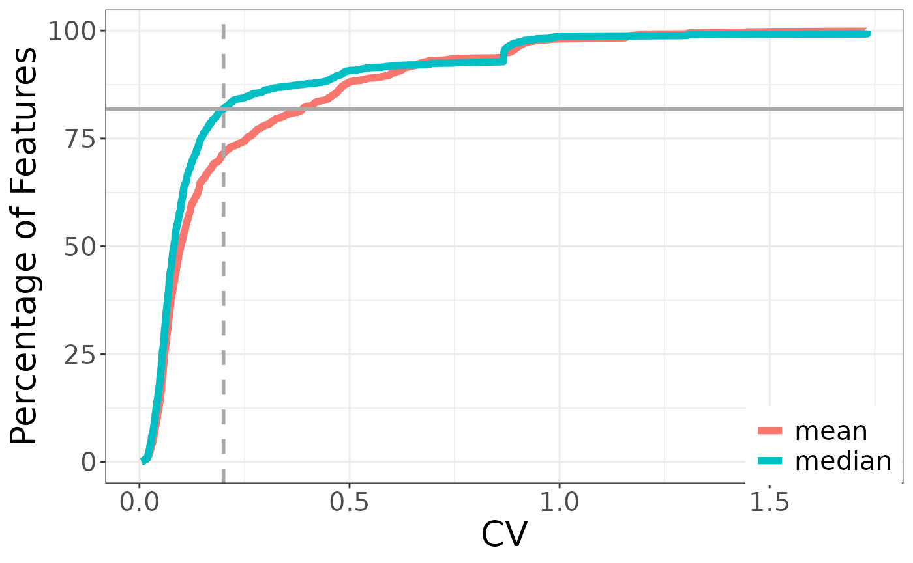
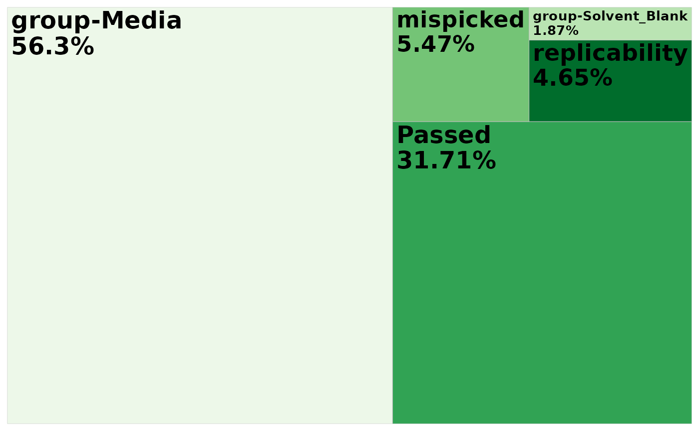
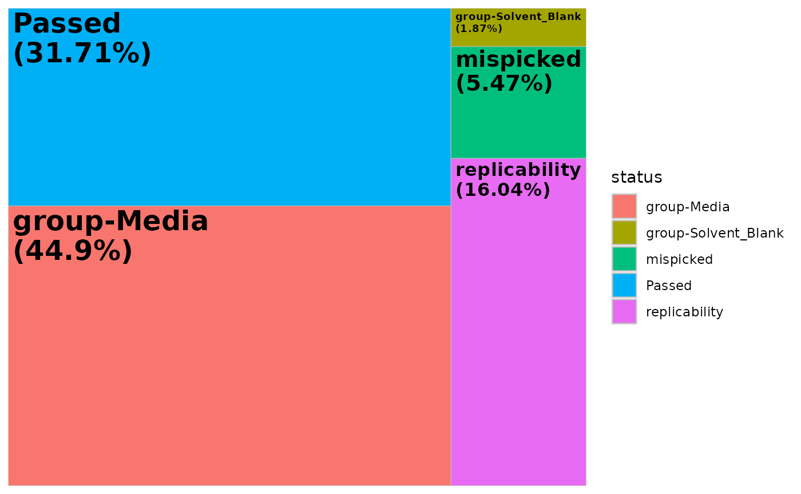
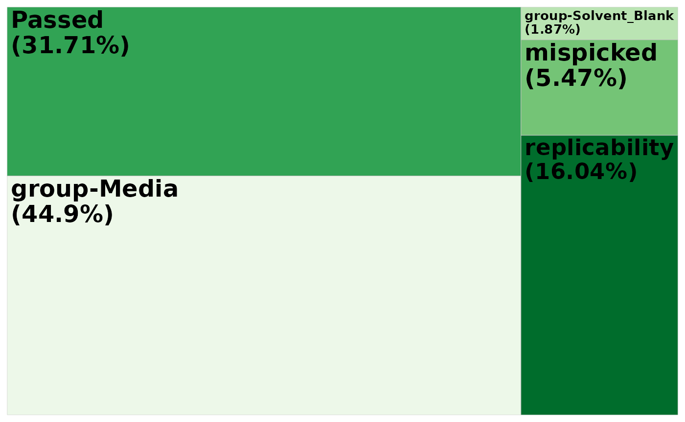
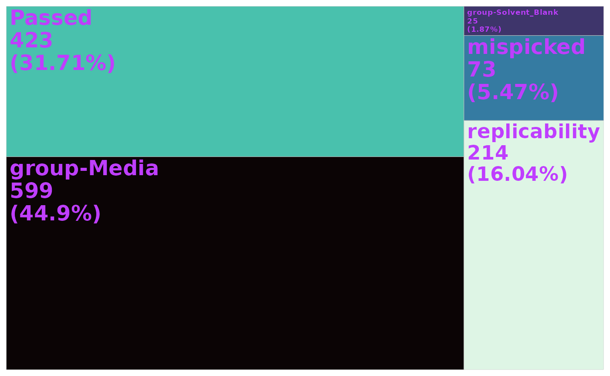

# Filter

``` r

# library(mpactr)
library(mpactr)
library(tidyverse)
```

## Load data into R

mpactr requires 2 files as input: a feature table and metadata file.
Both are expected to be comma separated files (*.csv*).

1.  peak_table: a peak table in Progenesis format is expected. To export
    a compatable peak table in Progenesis, navigate to the *Review
    Compounds* tab then File -\> Export Compound Measurements. Select
    the following properties: Compound, m/z, Retention time (min), and
    Raw abundance and click ok.
2.  metadata: a table with sample information. At minimum the following
    columns are expected: Injection, Sample_Code, and Biological_Group.
    Injection is the sample name and is expected to match sample column
    names in the peak_table. Sample_Code is the id for technical
    replicate groups. Biological_Group is the id for biological
    replicate groups. Other sample metadata can be added, and is
    encouraged for downstream analysis following filtering with mpactr.

To import your data into R, use the mpactr function
[`import_data()`](https://mums2.github.io/mpactr/reference/import_data.md),
which has the arguments: `peak_table_file_path` and
`meta_data_file_path`. Note - you do not need to use
[`example()`](https://mums2.github.io/mpactr/reference/example.md) if
you are using your own files. This is a package function that allows
access to internal package data. If you simply want to play around with
the packge using example data, you can run the `import_data` function as
shown above, otherwise, provide file paths for your own files. The
function is expecting files the the extension `.csv`. The `meta_data`
argument will also accept an R `data.frame` or `data.table` object,
assuming it is in the correct format. This can be useful of you need to
manually format an existing metadata file, or want to extract metadata
information from your peak table column names.

``` r

data <- import_data(example("cultures_peak_table.csv"),
  example("cultures_metadata.csv"),
  format = "Progenesis"
)
```

This will create an R6 class object, which will store both the peak
table and metadata.

Calling the new mpactr object will print the current peak table in the
terminal:

``` r

data
#>       Compound       mz         rt 102623_UM1848B_JC1_69_1_5004
#>         <char>    <num>      <num>                        <num>
#>    1:        1 256.0883  0.7748333                         0.00
#>    2:        2 484.2921  0.7756667                       546.56
#>    3:        3 445.2276  0.7786667                         0.00
#>    4:        4 354.1842  0.7786667                         0.00
#>    5:        5 353.1995  0.7816667                         0.00
#>   ---                                                          
#> 1330:     1330 538.3182 11.4396667                         0.00
#> 1331:     1331 424.2710 11.4315000                         0.00
#> 1332:     1332 422.1770 11.4568333                     10655.27
#> 1333:     1333 422.1776 11.4528333                       923.77
#> 1334:     1334 538.3981 11.4811667                      1176.19
#>       102623_UM1846B_Media_67_1_5005 102623_UM1847B_JC28_68_1_5006
#>                                <num>                         <num>
#>    1:                           0.00                       5358.26
#>    2:                       16389.28                          0.00
#>    3:                       22515.28                          0.00
#>    4:                        6086.35                          0.00
#>    5:                        5923.96                          0.00
#>   ---                                                             
#> 1330:                           0.00                      21222.45
#> 1331:                           0.00                      39842.07
#> 1332:                        5737.01                      33477.91
#> 1333:                           0.00                       6012.07
#> 1334:                        1353.96                      14792.94
#>       102623_UM1850B_ANGDT_71_1_5007 102623_UM1849B_ANG18_70_1_5008
#>                                <num>                          <num>
#>    1:                        4131.40                        3398.08
#>    2:                           0.00                           0.00
#>    3:                           0.00                        1641.70
#>    4:                           0.00                           0.00
#>    5:                           0.00                           0.00
#>   ---                                                              
#> 1330:                        5798.99                           0.00
#> 1331:                           0.00                       40318.68
#> 1332:                       28487.39                       11222.92
#> 1333:                        4634.47                        1250.37
#> 1334:                        3151.34                        1590.32
#>       102623_UM1852B_Coculture_72_1_5009 102623_MixedMonoculture_84_1_5015
#>                                    <num>                             <num>
#>    1:                            5464.43                           3299.94
#>    2:                               0.00                              0.00
#>    3:                               0.00                              0.00
#>    4:                               0.00                              0.00
#>    5:                               0.00                              0.00
#>   ---                                                                     
#> 1330:                           30536.02                           7732.14
#> 1331:                           26284.99                              0.00
#> 1332:                           20043.54                          20653.87
#> 1333:                            1112.28                           2910.70
#> 1334:                            1190.15                           5869.06
#>       102623_UM1848B_JC1_69_1_5017 102623_UM1846B_Media_67_1_5018
#>                              <num>                          <num>
#>    1:                         0.00                        2168.71
#>    2:                         0.00                       20194.55
#>    3:                         0.00                       19457.70
#>    4:                         0.00                        5966.08
#>    5:                         0.00                        5674.10
#>   ---                                                            
#> 1330:                         0.00                           0.00
#> 1331:                         0.00                           0.00
#> 1332:                     13961.88                        9107.94
#> 1333:                      1364.87                           0.00
#> 1334:                      1404.99                        1636.15
#>       102623_UM1847B_JC28_68_1_5019 102623_UM1850B_ANGDT_71_1_5020
#>                               <num>                          <num>
#>    1:                       5505.94                        3762.47
#>    2:                          0.00                           0.00
#>    3:                          0.00                           0.00
#>    4:                          0.00                           0.00
#>    5:                          0.00                           0.00
#>   ---                                                             
#> 1330:                      17782.36                        7420.76
#> 1331:                      37742.99                           0.00
#> 1332:                      30362.90                       28691.15
#> 1333:                       5510.67                        4081.40
#> 1334:                      15933.62                        2995.29
#>       102623_UM1849B_ANG18_70_1_5021 102623_UM1852B_Coculture_72_1_5022
#>                                <num>                              <num>
#>    1:                        3424.76                            4890.84
#>    2:                           0.00                               0.00
#>    3:                           0.00                               0.00
#>    4:                           0.00                               0.00
#>    5:                           0.00                               0.00
#>   ---                                                                  
#> 1330:                           0.00                           28742.16
#> 1331:                           0.00                           27778.21
#> 1332:                       11211.29                           18412.55
#> 1333:                        1096.25                               0.00
#> 1334:                        1350.04                            1429.84
#>       102623_MixedMonoculture_84_1_5028 102623_UM1848B_JC1_69_1_5030
#>                                   <num>                        <num>
#>    1:                           2870.98                         0.00
#>    2:                              0.00                         0.00
#>    3:                            651.95                         0.00
#>    4:                              0.00                         0.00
#>    5:                              0.00                         0.00
#>   ---                                                               
#> 1330:                           7830.13                         0.00
#> 1331:                          39217.34                     40432.41
#> 1332:                          20650.23                     15504.38
#> 1333:                           1604.38                      1643.83
#> 1334:                           5398.81                       982.25
#>       102623_UM1846B_Media_67_1_5031 102623_UM1847B_JC28_68_1_5032
#>                                <num>                         <num>
#>    1:                        2033.65                       5522.76
#>    2:                       18650.07                          0.00
#>    3:                       19542.19                          0.00
#>    4:                        6755.31                          0.00
#>    5:                        5971.36                          0.00
#>   ---                                                             
#> 1330:                           0.00                      18990.44
#> 1331:                       40989.54                      36259.55
#> 1332:                        8683.32                      29340.12
#> 1333:                           0.00                       5323.67
#> 1334:                        1791.72                      16808.92
#>       102623_UM1850B_ANGDT_71_1_5033 102623_UM1849B_ANG18_70_1_5034
#>                                <num>                          <num>
#>    1:                        3446.13                        3621.36
#>    2:                           0.00                           0.00
#>    3:                           0.00                           0.00
#>    4:                           0.00                           0.00
#>    5:                           0.00                           0.00
#>   ---                                                              
#> 1330:                        8203.37                           0.00
#> 1331:                           0.00                       38269.77
#> 1332:                       27768.08                       11750.24
#> 1333:                        4578.46                        1073.26
#> 1334:                        3039.45                        1120.35
#>       102623_UM1852B_Coculture_72_1_5035 102623_MixedMonoculture_84_1_5041
#>                                    <num>                             <num>
#>    1:                            5051.84                           3028.24
#>    2:                               0.00                            399.02
#>    3:                               0.00                            664.81
#>    4:                               0.00                              0.00
#>    5:                               0.00                              0.00
#>   ---                                                                     
#> 1330:                           29868.13                           8723.55
#> 1331:                           22049.76                          38174.90
#> 1332:                           18710.25                          21920.51
#> 1333:                               0.00                           1213.00
#> 1334:                            1306.39                           5012.83
#>       102423_Blank_77_1_5095 102423_Blank_77_2_5096 102423_Blank_77_3_5097
#>                        <num>                  <num>                  <num>
#>    1:                   0.00                      0                   0.00
#>    2:                   0.00                      0                   0.00
#>    3:                   0.00                      0                   0.00
#>    4:                   0.00                      0                   0.00
#>    5:                   0.00                      0                   0.00
#>   ---                                                                     
#> 1330:                   0.00                      0                   0.00
#> 1331:               20155.81                      0               35516.44
#> 1332:                   0.00                      0                   0.00
#> 1333:                   0.00                      0                   0.00
#> 1334:                   0.00                      0                   0.00
#>           kmd
#>         <num>
#>    1: 0.08831
#>    2: 0.29214
#>    3: 0.22763
#>    4: 0.18421
#>    5: 0.19945
#>   ---        
#> 1330: 0.31820
#> 1331: 0.27097
#> 1332: 0.17696
#> 1333: 0.17758
#> 1334: 0.39806
```

## Accessing data in mpactr object

You can extract the peak table or metadata at any point with
[`get_raw_data()`](https://mums2.github.io/mpactr/reference/get_raw_data.md),
[`get_peak_table()`](https://mums2.github.io/mpactr/reference/get_peak_table.md)
and
[`get_meta_data()`](https://mums2.github.io/mpactr/reference/get_meta_data.md)
functions. Both functions will return a `data.table` object with the
corresponding information.

### Extract peak table

The raw peak table is the unfiltered peak table used as input to mpactr.
To extract the raw input peak table, use the function
[`get_raw_data()`](https://mums2.github.io/mpactr/reference/get_raw_data.md).

``` r

get_raw_data(data)[1:5, 1:8]
#>    Compound       mz        rt 102623_UM1848B_JC1_69_1_5004
#>       <num>    <num>     <num>                        <num>
#> 1:        1 256.0883 0.7748333                         0.00
#> 2:        2 484.2921 0.7756667                       546.56
#> 3:        3 445.2276 0.7786667                         0.00
#> 4:        4 354.1842 0.7786667                         0.00
#> 5:        5 353.1995 0.7816667                         0.00
#>    102623_UM1846B_Media_67_1_5005 102623_UM1847B_JC28_68_1_5006
#>                             <num>                         <num>
#> 1:                           0.00                       5358.26
#> 2:                       16389.28                          0.00
#> 3:                       22515.28                          0.00
#> 4:                        6086.35                          0.00
#> 5:                        5923.96                          0.00
#>    102623_UM1850B_ANGDT_71_1_5007 102623_UM1849B_ANG18_70_1_5008
#>                             <num>                          <num>
#> 1:                         4131.4                        3398.08
#> 2:                            0.0                           0.00
#> 3:                            0.0                        1641.70
#> 4:                            0.0                           0.00
#> 5:                            0.0                           0.00
```

The raw peak table will not change as filters are applied to the data.
If you want to extract the filtered peak table, with filters that have
been applied, use
[`get_peak_table()`](https://mums2.github.io/mpactr/reference/get_peak_table.md):

``` r

get_peak_table(data)[1:5, 1:8]
#>    Compound       mz        rt 102623_UM1848B_JC1_69_1_5004
#>      <char>    <num>     <num>                        <num>
#> 1:        1 256.0883 0.7748333                         0.00
#> 2:        2 484.2921 0.7756667                       546.56
#> 3:        3 445.2276 0.7786667                         0.00
#> 4:        4 354.1842 0.7786667                         0.00
#> 5:        5 353.1995 0.7816667                         0.00
#>    102623_UM1846B_Media_67_1_5005 102623_UM1847B_JC28_68_1_5006
#>                             <num>                         <num>
#> 1:                           0.00                       5358.26
#> 2:                       16389.28                          0.00
#> 3:                       22515.28                          0.00
#> 4:                        6086.35                          0.00
#> 5:                        5923.96                          0.00
#>    102623_UM1850B_ANGDT_71_1_5007 102623_UM1849B_ANG18_70_1_5008
#>                             <num>                          <num>
#> 1:                         4131.4                        3398.08
#> 2:                            0.0                           0.00
#> 3:                            0.0                        1641.70
#> 4:                            0.0                           0.00
#> 5:                            0.0                           0.00
```

### Extract metadata

``` r

get_meta_data(data)[1:5, ]
#>                         Injection Sample_Code Biological_Group dilution
#>                            <char>      <char>           <char>    <num>
#> 1:   102623_UM1848B_JC1_69_1_5004     UM1848B              JC1        1
#> 2: 102623_UM1846B_Media_67_1_5005     UM1846B            Media        1
#> 3:  102623_UM1847B_JC28_68_1_5006     UM1847B             JC28        1
#> 4: 102623_UM1850B_ANGDT_71_1_5007     UM1850B            ANGDT        1
#> 5: 102623_UM1849B_ANG18_70_1_5008     UM1849B            ANG18        1
```

## Reference semantics

mpactr is built on an R6 class-system, meaning it operates on reference
semantics in which data is updated *in-place*. Compared to a shallow
copy, where only data pointers are copied, or a deep copy, where the
entire data object is copied in memory, any changes to the original data
object, regardless if they are assigned to a new object, result in
changes to the original data object. We can see this below.

Where the raw data object has 1334 ions in the feature table:

``` r

data2 <- import_data(example("cultures_peak_table.csv"),
  example("cultures_metadata.csv"),
  format = "Progenesis"
)


get_peak_table(data2)[, 1:5]
#>       Compound       mz         rt 102623_UM1848B_JC1_69_1_5004
#>         <char>    <num>      <num>                        <num>
#>    1:        1 256.0883  0.7748333                         0.00
#>    2:        2 484.2921  0.7756667                       546.56
#>    3:        3 445.2276  0.7786667                         0.00
#>    4:        4 354.1842  0.7786667                         0.00
#>    5:        5 353.1995  0.7816667                         0.00
#>   ---                                                          
#> 1330:     1330 538.3182 11.4396667                         0.00
#> 1331:     1331 424.2710 11.4315000                         0.00
#> 1332:     1332 422.1770 11.4568333                     10655.27
#> 1333:     1333 422.1776 11.4528333                       923.77
#> 1334:     1334 538.3981 11.4811667                      1176.19
#>       102623_UM1846B_Media_67_1_5005
#>                                <num>
#>    1:                           0.00
#>    2:                       16389.28
#>    3:                       22515.28
#>    4:                        6086.35
#>    5:                        5923.96
#>   ---                               
#> 1330:                           0.00
#> 1331:                           0.00
#> 1332:                        5737.01
#> 1333:                           0.00
#> 1334:                        1353.96
```

We can run the `filter_mispicked_ions` filter, with default setting
`copy_object = FALSE` (operates on reference semantics).

``` r

data2_mispicked <- filter_mispicked_ions(data2,
  ringwin = 0.5,
  isowin = 0.01, trwin = 0.005,
  max_iso_shift = 3, merge_peaks = TRUE,
  merge_method = "sum",
  copy_object = FALSE
)
#> ℹ Checking 1334 peaks for mispicked peaks.
#> ℹ Argument merge_peaks is: TRUE. Merging mispicked peaks with method sum.
#> ✔ 73 ions failed the mispicked filter, 1261 ions remain.

get_peak_table(data2_mispicked)[, 1:5]
#> Key: <Compound, mz, kmd, rt>
#>       Compound       mz     kmd        rt 102423_Blank_77_1_5095
#>         <char>    <num>   <num>     <num>                  <num>
#>    1:        1 256.0883 0.08831 0.7748333                      0
#>    2:       10 340.2040 0.20399 0.7916667                      0
#>    3:      100 557.1519 0.15191 3.6925000                      0
#>    4:     1000 278.0638 0.06382 5.5228333                      0
#>    5:     1001 296.0736 0.07365 5.5246667                      0
#>   ---                                                           
#> 1257:      995 561.2726 0.27255 5.4810000                      0
#> 1258:      996 228.1430 0.14305 5.4818333                      0
#> 1259:      997 425.1873 0.18726 5.4640000                      0
#> 1260:      998 337.1987 0.19873 5.4818333                      0
#> 1261:      999 640.3299 0.32993 5.4596667                      0
```

This results in 1261 ions in the feature table (above). Even though we
created an object called `data2_mispicked`, the original `data2` object
was also updated and now has 1261 ions in the feature table:

``` r

get_peak_table(data2)[, 1:5]
#> Key: <Compound, mz, kmd, rt>
#>       Compound       mz     kmd        rt 102423_Blank_77_1_5095
#>         <char>    <num>   <num>     <num>                  <num>
#>    1:        1 256.0883 0.08831 0.7748333                      0
#>    2:       10 340.2040 0.20399 0.7916667                      0
#>    3:      100 557.1519 0.15191 3.6925000                      0
#>    4:     1000 278.0638 0.06382 5.5228333                      0
#>    5:     1001 296.0736 0.07365 5.5246667                      0
#>   ---                                                           
#> 1257:      995 561.2726 0.27255 5.4810000                      0
#> 1258:      996 228.1430 0.14305 5.4818333                      0
#> 1259:      997 425.1873 0.18726 5.4640000                      0
#> 1260:      998 337.1987 0.19873 5.4818333                      0
#> 1261:      999 640.3299 0.32993 5.4596667                      0
```

We recommend using the default `copy_object = FALSE` as this makes for
an extremely fast and memory-efficient way to chain mpactr filters
together (see **Chaining filters together** section and [Reference
Semantics](https://mums2.github.io/mpactr/articles/articles/reference_semantics.md));
however, if you would like to run the filters individually with
traditional R style objects, you can set `copy_object` to `TRUE` as
shown in the filter examples.

## Filtering

mpactr provides filters to correct for the following issues observed
during preprocessing of tandem MS/MS data:

- mispicked ions: isotopic patterns that are incorrectly split during
  preprocessing.
- solvent blank contamination: removal of features present in solvent
  blanks due to carryover between samples.
- background components: features whose abundance is greater than
  user-defined abundance threshold in a specific group of samples, for
  example media blanks.
- non-reproducible ions: those that are inconsistent between technical
  replicates.
- insource ions: fragment ions created during ionization before
  fragmentation in the tandem MS/MS workflow.

#### Mispicked ions filter

To check for mispicked ions, use mpactr function
[`filter_mispicked_ions()`](https://mums2.github.io/mpactr/reference/filter_mispicked_ions.md).
This function takes an `mpactr object` as input, and checks for similar
ions with the arguments `ringwin`, `isowin`, `trwin` and
`max_iso_shift`.

Ions in the feature table are flagged as similar based on retention time
and mass. Flagged ion groups are suggested to be the result of incorrect
splitting of isotopic patterns during peak picking, detector saturation
artifacts, or incorrect identification of multiply charged oligomers.

``` r

data_mispicked <- filter_mispicked_ions(data,
  ringwin = 0.5,
  isowin = 0.01, trwin = 0.005,
  max_iso_shift = 3, merge_peaks = TRUE,
  merge_method = "sum",
  copy_object = TRUE
)
#> ℹ Checking 1334 peaks for mispicked peaks.
#> ℹ Argument merge_peaks is: TRUE. Merging mispicked peaks with method sum.
#> ✔ 73 ions failed the mispicked filter, 1261 ions remain.
```

Each filter reports progress of filtering, here we can see that 1334
ions were present prior to checking for mispicked ions. 73 ions were
found to be similar to another ion and following merging, 1261 ions
remain.

If you are interested in the groups of similar ions flagged in this
filter, you can use
[`get_similar_ions()`](https://mums2.github.io/mpactr/reference/get_similar_ions.md).
This function returns a `data.table` reporting the main ion (the ion
retained post-merging) and the ions similar to it.

``` r

head(get_similar_ions(data_mispicked))
#>    main_ion similar_ions
#>      <char>       <list>
#> 1:     1188         1189
#> 2:      939          945
#> 3:      898          896
#> 4:     1214         1210
#> 5:     1253         1249
#> 6:      886          884
```

#### Remove ions that are above a threshold in one biological group

Removing solvent blank impurities is important for correcting for
between-sample carryover and contamination in experimental samples. You
can identify and remove these ions with mpactr’s
[`filter_group()`](https://mums2.github.io/mpactr/reference/filter_group.md)
function.
[`filter_group()`](https://mums2.github.io/mpactr/reference/filter_group.md)
identifies ions above a relative abundance threshold (`group_threshold`)
in a specific group (`group_to_remove`). To remove solvent blank
impurities, set `group_to_remove` to the `Biological_Group` in your
metadata file which corresponds to your solvent blank samples, here
“Solvent_Blank”.

``` r

data_blank <- filter_group(data,
  group_threshold = 0.01,
  group_to_remove = "Solvent_Blank", remove_ions = TRUE,
  copy_object = TRUE
)
#> ℹ Parsing 1334 peaks based on the sample group: Solvent_Blank.
#> ℹ Argument remove_ions is: TRUE.Removing peaks from Solvent_Blank.
#> ✔ 26 ions failed the Solvent_Blank filter, 1308 ions remain.
```

In this example, 1334 ions were present prior to the group filter. 26
ions were found to be above the relative abundance threshold of 0.01 in
“Solvent_Blank” samples, leaving 1308 ions in the peak table.

We can also use this filter to remove ions from other groups, such as
media blanks. This can be useful for experiments on cell cultures. The
example data contains samples belonging to the `Biological_Group`
“Media”. These samples are from media blanks, which are negative
controls from the growth experiments conducted in this study. We can
remove features whose abundance is greater than 1% of the largest group
in media blank samples by specifying `group_to_remove` = “Media”. We
recommend removing media blank ions following all other filters so all
high-quality ions are identified (see Chaining filters together below).

``` r

data_media_blank <- filter_group(data,
  group_threshold = 0.01,
  group_to_remove = "Media", remove_ions = TRUE,
  copy_object = TRUE
)
#> ℹ Parsing 1334 peaks based on the sample group: Media.
#> ℹ Argument remove_ions is: TRUE.Removing peaks from Media.
#> ✔ 824 ions failed the Media filter, 510 ions remain.
```

#### Remove non-reproducible ions

Ions whose abundance are not consisent between technical replicates
(*i.e.*, non-reproducible) may not be reliable for analysis and
therefore should be removed from the feature table. Non-reproducible
ions are identified by mean or median coefficient of variation (CV)
between technical replicates with
[`filter_cv()`](https://mums2.github.io/mpactr/reference/filter_cv.md).
Note - this filter cannot be applied to data that does not contain
technical replicates.

``` r

data_rep <- filter_cv(data,
  cv_threshold = 0.2, cv_param = "median",
  copy_object = TRUE
)
#> ℹ Parsing 1334 peaks for replicability across technical replicates.
#> ✔ 241 ions failed the cv_filter filter, 1093 ions remain.
```

In our example dataset, 241 ions were flagged as non-reproducible. These
ions were removed, leaving 1093 ions in the feature table.

If you would like to visualize how the CV threshold performed on your
dataset, you can extract the CV calculated during `filer_cv()` using
mpactr’s
[`get_cv_data()`](https://mums2.github.io/mpactr/reference/get_cv_data.md)
function, and calculate the percentage of features for plotting. You can
look at both mean and median CV as shown in the example below, or you
can filter the data by the parameter of choice.

``` r

cv <- get_cv_data(data_rep) %>%
  pivot_longer(cols = c("mean_cv", "median_cv"),
               names_to = "param",
               values_to = "cv") %>%
  nest(.by = param) %>%
  mutate(
    data = map(data, arrange, cv),
    data = map(data, mutate, index = 0:(length(cv) - 1)),
    data = map(data, mutate, index_scale = index * 100 / length(cv))
  )

head(cv)
#> # A tibble: 2 × 2
#>   param     data                
#>   <chr>     <list>              
#> 1 mean_cv   <tibble [1,334 × 4]>
#> 2 median_cv <tibble [1,334 × 4]>
```

The nested data are tibbles with the columns Compound, cv, index,
index_scale:

    #> # A tibble: 6 × 4
    #>   Compound      cv index index_scale
    #>   <chr>      <dbl> <int>       <dbl>
    #> 1 455      0.00500     0      0     
    #> 2 364      0.00720     1      0.0750
    #> 3 409      0.00787     2      0.150 
    #> 4 435      0.00803     3      0.225 
    #> 5 1003     0.00887     4      0.300 
    #> 6 1117     0.0115      5      0.375

There is one tibble for each parameter (either mean or median). We also
want to calculate the percentage of features represented by the CV
threshold.

``` r

cv_thresh_percent <- cv %>%
  filter(param == "median_cv") %>%
  unnest(cols = data) %>%
  mutate(diff_cv_thresh = abs(cv - 0.2)) %>%
  slice_min(diff_cv_thresh, n = 1) %>%
  pull(index_scale)

cv_thresh_percent
#> [1] 81.85907
```

Then we can plot percentage of features by CV:

``` r

cv %>%
  unnest(cols = data) %>%
  mutate(param = factor(param, levels = c("mean_cv", "median_cv"),
                        labels = c("mean", "median"))) %>%
  ggplot() +
  aes(x = cv, y = index_scale, group = param, color = param) +
  geom_line(linewidth = 2) +
  geom_vline(xintercept = 0.2,
             color = "darkgrey",
             linetype = "dashed",
             linewidth = 1) +
  geom_hline(yintercept = cv_thresh_percent,
             color = "darkgrey",
             linewidth = 1) +
  labs(x = "CV",
       y = "Percentage of Features",
       param = "Statistic") +
  theme_bw() +
  theme(
    axis.title = element_text(size = 20),
    axis.text = element_text(size = 15),
    legend.position = "inside",
    legend.position.inside = c(.90, .08),
    legend.title = element_blank(),
    legend.text = element_text(size = 15)
  )
#> Ignoring unknown labels:
#> • param : "Statistic"
```



Here we can see that roughly 80% of features were below the CV threshold
meaning 20% were removed at a CV threshold of 0.2.

#### Remove insource fragment ions

Some mass species can be fragmented during ionization in tandem MS/MS,
creating insource ions. This can result in ions from one compound being
represented more than once in the feature table. If you would like to
remove insource ions fragments, you can do so with mpactr’s
[`filter_insource_ions()`](https://mums2.github.io/mpactr/reference/filter_insource_ions.md).
[`filter_insource_ions()`](https://mums2.github.io/mpactr/reference/filter_insource_ions.md)
conducts ion deconvolution via retention time correlation matrices
within MS1 scans. Highly correlated ion groups are determined by the
`cluster_threshold` parameter and filtered to remove the low mass
features. The highest mass feature is identified as the likely precursor
ion and retained in the feature table.

``` r

data_insource <- filter_insource_ions(data,
  cluster_threshold = 0.95,
  copy_object = TRUE
)
#> ℹ Parsing 1334 peaks for insource ions.
#> ✔ 72 ions failed the insource filter, 1262 ions remain.
```

72 ions were identified and removed during deconvolution of this
dataset, leaving 1262 ions in the feature table.

#### Chaining filters together

Filters can be chained in a customizable workflow, shown below. While
filters can be chained in any order, we recommend filtering mispicked
ions, then solvent blanks, prior to filtering non-repoducible or
insource ions. This will allow for incorrectly picked peaks to be merged
and any contamination/carryover removed prior to identifying
non-reproducible and insource fragment ions. Here we also demonstrate
the removal of media blank components with the
[`filter_group()`](https://mums2.github.io/mpactr/reference/filter_group.md)
function after identification of high-quality ions.

``` r

data <- import_data(example("cultures_peak_table.csv"),
  example("cultures_metadata.csv"),
  format = "Progenesis"
)

data_filtered <- filter_mispicked_ions(data, merge_method = "sum") |>
  filter_group(group_to_remove = "Solvent_Blank") |>
  filter_cv(cv_threshold = 0.2, cv_param = "median") |>
  filter_group(group_to_remove = "Media") 
#> ℹ Checking 1334 peaks for mispicked peaks.
#> ℹ Argument merge_peaks is: TRUE. Merging mispicked peaks with method sum.
#> ✔ 73 ions failed the mispicked filter, 1261 ions remain.
#> ℹ Parsing 1261 peaks based on the sample group: Solvent_Blank.
#> ℹ Argument remove_ions is: TRUE.Removing peaks from Solvent_Blank.
#> ✔ 25 ions failed the Solvent_Blank filter, 1236 ions remain.
#> ℹ Parsing 1236 peaks for replicability across technical replicates.
#> ✔ 214 ions failed the cv_filter filter, 1022 ions remain.
#> ℹ Parsing 1022 peaks based on the sample group: Media.
#> ℹ Argument remove_ions is: TRUE.Removing peaks from Media.
#> ✔ 599 ions failed the Media filter, 423 ions remain.
```

## Summary

mpactr offers mutliple ways to view a summary of data filtering.

#### View passing and failed ions for a single filter

If you are interested in viewing the passing and failing ions for a
single filter, use the
[`filter_summary()`](https://mums2.github.io/mpactr/reference/filter_summary.md)
function. You must specify which filter you are intested in, either
“mispicked”, “group”, “replicability”, or “insource”.

``` r

mispicked_summary <- filter_summary(data_filtered, filter = "mispicked")
```

Failed ions:

``` r

mispicked_summary$failed_ions
#>  [1] "1189" "945"  "896"  "1210" "1249" "884"  "1060" "1008" "1304" "1271"
#> [11] "1326" "1333" "937"  "1250" "1196" "1014" "895"  "1228" "817"  "853" 
#> [21] "1122" "938"  "743"  "1145" "1021" "946"  "161"  "1032" "1033" "282" 
#> [31] "154"  "779"  "1254" "1224" "260"  "264"  "18"   "1012" "800"  "1251"
#> [41] "901"  "969"  "1259" "1223" "528"  "1095" "927"  "1242" "410"  "1260"
#> [51] "427"  "1157" "1206" "393"  "1252" "1204" "975"  "584"  "1282" "1090"
#> [61] "1257" "507"  "1087" "1153" "1261" "371"  "373"  "340"  "1267" "546" 
#> [71] "495"  "1289" "1290"
```

Passing ions:

``` r

head(mispicked_summary$passed_ions, 100)
#>   [1] "1"    "10"   "100"  "1000" "1001" "1002" "1003" "1004" "1005" "1006"
#>  [11] "1007" "1009" "101"  "1010" "1011" "1013" "1015" "1016" "1017" "1018"
#>  [21] "1019" "102"  "1020" "1022" "1023" "1024" "1025" "1026" "1027" "1028"
#>  [31] "1029" "103"  "1030" "1031" "1034" "1035" "1036" "1037" "1038" "1039"
#>  [41] "104"  "1040" "1041" "1042" "1043" "1044" "1045" "1046" "1047" "1048"
#>  [51] "1049" "105"  "1050" "1051" "1052" "1053" "1054" "1055" "1056" "1057"
#>  [61] "1058" "1059" "106"  "1061" "1062" "1063" "1064" "1065" "1066" "1067"
#>  [71] "1068" "1069" "107"  "1070" "1071" "1072" "1073" "1074" "1075" "1076"
#>  [81] "1077" "1078" "1079" "108"  "1080" "1081" "1082" "1083" "1084" "1085"
#>  [91] "1086" "1088" "1089" "109"  "1091" "1092" "1093" "1094" "1096" "1097"
```

If you set `filter` to a filter name that you did not apply to your
data, an error message will be returned.

``` r

filter_summary(data_filtered, filter = "insource")
#> Error in `mpactr_object$get_log()`:
#> ! `filter` insource has not yet been applied to the data. Run the
#>   corresponding filter function prior to extracting the summary.
```

If you want to retrieve the filter summary for the group filter, you
must also supply the group name with the `group` argument:

``` r

filter_summary(data_filtered, filter = "group", group = "Solvent_Blank")
#> $failed_ions
#>  [1] "1275" "1324" "1325" "1330" "1331" "684"  "697"  "698"  "709"  "713" 
#> [11] "714"  "717"  "720"  "725"  "730"  "731"  "735"  "736"  "737"  "740" 
#> [21] "747"  "750"  "752"  "754"  "755" 
#> 
#> $passed_ions
#>    [1] "1"    "10"   "100"  "1000" "1001" "1002" "1003" "1004" "1005" "1006"
#>   [11] "1007" "1009" "101"  "1010" "1011" "1013" "1015" "1016" "1017" "1018"
#>   [21] "1019" "102"  "1020" "1022" "1023" "1024" "1025" "1026" "1027" "1028"
#>   [31] "1029" "103"  "1030" "1031" "1034" "1035" "1036" "1037" "1038" "1039"
#>   [41] "104"  "1040" "1041" "1042" "1043" "1044" "1045" "1046" "1047" "1048"
#>   [51] "1049" "105"  "1050" "1051" "1052" "1053" "1054" "1055" "1056" "1057"
#>   [61] "1058" "1059" "106"  "1061" "1062" "1063" "1064" "1065" "1066" "1067"
#>   [71] "1068" "1069" "107"  "1070" "1071" "1072" "1073" "1074" "1075" "1076"
#>   [81] "1077" "1078" "1079" "108"  "1080" "1081" "1082" "1083" "1084" "1085"
#>   [91] "1086" "1088" "1089" "109"  "1091" "1092" "1093" "1094" "1096" "1097"
#>  [101] "1098" "1099" "11"   "110"  "1100" "1101" "1102" "1103" "1104" "1105"
#>  [111] "1106" "1107" "1108" "1109" "111"  "1110" "1111" "1112" "1113" "1114"
#>  [121] "1115" "1116" "1117" "1118" "1119" "112"  "1120" "1121" "1123" "1124"
#>  [131] "1125" "1126" "1127" "1128" "1129" "113"  "1130" "1131" "1132" "1133"
#>  [141] "1134" "1135" "1136" "1137" "1138" "1139" "114"  "1140" "1141" "1142"
#>  [151] "1143" "1144" "1146" "1147" "1148" "1149" "115"  "1150" "1151" "1152"
#>  [161] "1154" "1155" "1156" "1158" "1159" "116"  "1160" "1161" "1162" "1163"
#>  [171] "1164" "1165" "1166" "1167" "1168" "1169" "117"  "1170" "1171" "1172"
#>  [181] "1173" "1174" "1175" "1176" "1177" "1178" "1179" "118"  "1180" "1181"
#>  [191] "1182" "1183" "1184" "1185" "1186" "1187" "1188" "119"  "1190" "1191"
#>  [201] "1192" "1193" "1194" "1195" "1197" "1198" "1199" "12"   "120"  "1200"
#>  [211] "1201" "1202" "1203" "1205" "1207" "1208" "1209" "121"  "1211" "1212"
#>  [221] "1213" "1214" "1215" "1216" "1217" "1218" "1219" "122"  "1220" "1221"
#>  [231] "1222" "1225" "1226" "1227" "1229" "123"  "1230" "1231" "1232" "1233"
#>  [241] "1234" "1235" "1236" "1237" "1238" "1239" "124"  "1240" "1241" "1243"
#>  [251] "1244" "1245" "1246" "1247" "1248" "125"  "1253" "1255" "1256" "1258"
#>  [261] "126"  "1262" "1263" "1264" "1265" "1266" "1268" "1269" "127"  "1270"
#>  [271] "1272" "1273" "1274" "1276" "1277" "1278" "1279" "128"  "1280" "1281"
#>  [281] "1283" "1284" "1285" "1286" "1287" "1288" "129"  "1291" "1292" "1293"
#>  [291] "1294" "1295" "1296" "1297" "1298" "1299" "13"   "130"  "1300" "1301"
#>  [301] "1302" "1303" "1305" "1306" "1307" "1308" "1309" "131"  "1310" "1311"
#>  [311] "1312" "1313" "1314" "1315" "1316" "1317" "1318" "1319" "132"  "1320"
#>  [321] "1321" "1322" "1323" "1327" "1328" "1329" "133"  "1332" "1334" "134" 
#>  [331] "135"  "136"  "137"  "138"  "139"  "14"   "140"  "141"  "142"  "143" 
#>  [341] "144"  "145"  "146"  "147"  "148"  "149"  "15"   "150"  "151"  "152" 
#>  [351] "153"  "155"  "156"  "157"  "158"  "159"  "16"   "160"  "162"  "163" 
#>  [361] "164"  "165"  "166"  "167"  "168"  "169"  "17"   "170"  "171"  "172" 
#>  [371] "173"  "174"  "175"  "176"  "177"  "178"  "179"  "180"  "181"  "182" 
#>  [381] "183"  "184"  "185"  "186"  "187"  "188"  "189"  "19"   "190"  "191" 
#>  [391] "192"  "193"  "194"  "195"  "196"  "197"  "198"  "199"  "2"    "20"  
#>  [401] "200"  "201"  "202"  "203"  "204"  "205"  "206"  "207"  "208"  "209" 
#>  [411] "21"   "210"  "211"  "212"  "213"  "214"  "215"  "216"  "217"  "218" 
#>  [421] "219"  "22"   "220"  "221"  "222"  "223"  "224"  "225"  "226"  "227" 
#>  [431] "228"  "229"  "23"   "230"  "231"  "232"  "233"  "234"  "235"  "236" 
#>  [441] "237"  "238"  "239"  "24"   "240"  "241"  "242"  "243"  "244"  "245" 
#>  [451] "246"  "247"  "248"  "249"  "25"   "250"  "251"  "252"  "253"  "254" 
#>  [461] "255"  "256"  "257"  "258"  "259"  "26"   "261"  "262"  "263"  "265" 
#>  [471] "266"  "267"  "268"  "269"  "27"   "270"  "271"  "272"  "273"  "274" 
#>  [481] "275"  "276"  "277"  "278"  "279"  "28"   "280"  "281"  "283"  "284" 
#>  [491] "285"  "286"  "287"  "288"  "289"  "29"   "290"  "291"  "292"  "293" 
#>  [501] "294"  "295"  "296"  "297"  "298"  "299"  "3"    "30"   "300"  "301" 
#>  [511] "302"  "303"  "304"  "305"  "306"  "307"  "308"  "309"  "31"   "310" 
#>  [521] "311"  "312"  "313"  "314"  "315"  "316"  "317"  "318"  "319"  "32"  
#>  [531] "320"  "321"  "322"  "323"  "324"  "325"  "326"  "327"  "328"  "329" 
#>  [541] "33"   "330"  "331"  "332"  "333"  "334"  "335"  "336"  "337"  "338" 
#>  [551] "339"  "34"   "341"  "342"  "343"  "344"  "345"  "346"  "347"  "348" 
#>  [561] "349"  "35"   "350"  "351"  "352"  "353"  "354"  "355"  "356"  "357" 
#>  [571] "358"  "359"  "36"   "360"  "361"  "362"  "363"  "364"  "365"  "366" 
#>  [581] "367"  "368"  "369"  "37"   "370"  "372"  "374"  "375"  "376"  "377" 
#>  [591] "378"  "379"  "38"   "380"  "381"  "382"  "383"  "384"  "385"  "386" 
#>  [601] "387"  "388"  "389"  "39"   "390"  "391"  "392"  "394"  "395"  "396" 
#>  [611] "397"  "398"  "399"  "4"    "40"   "400"  "401"  "402"  "403"  "404" 
#>  [621] "405"  "406"  "407"  "408"  "409"  "41"   "411"  "412"  "413"  "414" 
#>  [631] "415"  "416"  "417"  "418"  "419"  "42"   "420"  "421"  "422"  "423" 
#>  [641] "424"  "425"  "426"  "428"  "429"  "43"   "430"  "431"  "432"  "433" 
#>  [651] "434"  "435"  "436"  "437"  "438"  "439"  "44"   "440"  "441"  "442" 
#>  [661] "443"  "444"  "445"  "446"  "447"  "448"  "449"  "45"   "450"  "451" 
#>  [671] "452"  "453"  "454"  "455"  "456"  "457"  "458"  "459"  "46"   "460" 
#>  [681] "461"  "462"  "463"  "464"  "465"  "466"  "467"  "468"  "469"  "47"  
#>  [691] "470"  "471"  "472"  "473"  "474"  "475"  "476"  "477"  "478"  "479" 
#>  [701] "48"   "480"  "481"  "482"  "483"  "484"  "485"  "486"  "487"  "488" 
#>  [711] "489"  "49"   "490"  "491"  "492"  "493"  "494"  "496"  "497"  "498" 
#>  [721] "499"  "5"    "50"   "500"  "501"  "502"  "503"  "504"  "505"  "506" 
#>  [731] "508"  "509"  "51"   "510"  "511"  "512"  "513"  "514"  "515"  "516" 
#>  [741] "517"  "518"  "519"  "52"   "520"  "521"  "522"  "523"  "524"  "525" 
#>  [751] "526"  "527"  "529"  "53"   "530"  "531"  "532"  "533"  "534"  "535" 
#>  [761] "536"  "537"  "538"  "539"  "54"   "540"  "541"  "542"  "543"  "544" 
#>  [771] "545"  "547"  "548"  "549"  "55"   "550"  "551"  "552"  "553"  "554" 
#>  [781] "555"  "556"  "557"  "558"  "559"  "56"   "560"  "561"  "562"  "563" 
#>  [791] "564"  "565"  "566"  "567"  "568"  "569"  "57"   "570"  "571"  "572" 
#>  [801] "573"  "574"  "575"  "576"  "577"  "578"  "579"  "58"   "580"  "581" 
#>  [811] "582"  "583"  "585"  "586"  "587"  "588"  "589"  "59"   "590"  "591" 
#>  [821] "592"  "593"  "594"  "595"  "596"  "597"  "598"  "599"  "6"    "60"  
#>  [831] "600"  "601"  "602"  "603"  "604"  "605"  "606"  "607"  "608"  "609" 
#>  [841] "61"   "610"  "611"  "612"  "613"  "614"  "615"  "616"  "617"  "618" 
#>  [851] "619"  "62"   "620"  "621"  "622"  "623"  "624"  "625"  "626"  "627" 
#>  [861] "628"  "629"  "63"   "630"  "631"  "632"  "633"  "634"  "635"  "636" 
#>  [871] "637"  "638"  "639"  "64"   "640"  "641"  "642"  "643"  "644"  "645" 
#>  [881] "646"  "647"  "648"  "649"  "65"   "650"  "651"  "652"  "653"  "654" 
#>  [891] "655"  "656"  "657"  "658"  "659"  "66"   "660"  "661"  "662"  "663" 
#>  [901] "664"  "665"  "666"  "667"  "668"  "669"  "67"   "670"  "671"  "672" 
#>  [911] "673"  "674"  "675"  "676"  "677"  "678"  "679"  "68"   "680"  "681" 
#>  [921] "682"  "683"  "685"  "686"  "687"  "688"  "689"  "69"   "690"  "691" 
#>  [931] "692"  "693"  "694"  "695"  "696"  "699"  "7"    "70"   "700"  "701" 
#>  [941] "702"  "703"  "704"  "705"  "706"  "707"  "708"  "71"   "710"  "711" 
#>  [951] "712"  "715"  "716"  "718"  "719"  "72"   "721"  "722"  "723"  "724" 
#>  [961] "726"  "727"  "728"  "729"  "73"   "732"  "733"  "734"  "738"  "739" 
#>  [971] "74"   "741"  "742"  "744"  "745"  "746"  "748"  "749"  "75"   "751" 
#>  [981] "753"  "756"  "757"  "758"  "759"  "76"   "760"  "761"  "762"  "763" 
#>  [991] "764"  "765"  "766"  "767"  "768"  "769"  "77"   "770"  "771"  "772" 
#> [1001] "773"  "774"  "775"  "776"  "777"  "778"  "78"   "780"  "781"  "782" 
#> [1011] "783"  "784"  "785"  "786"  "787"  "788"  "789"  "79"   "790"  "791" 
#> [1021] "792"  "793"  "794"  "795"  "796"  "797"  "798"  "799"  "8"    "80"  
#> [1031] "801"  "802"  "803"  "804"  "805"  "806"  "807"  "808"  "809"  "81"  
#> [1041] "810"  "811"  "812"  "813"  "814"  "815"  "816"  "818"  "819"  "82"  
#> [1051] "820"  "821"  "822"  "823"  "824"  "825"  "826"  "827"  "828"  "829" 
#> [1061] "83"   "830"  "831"  "832"  "833"  "834"  "835"  "836"  "837"  "838" 
#> [1071] "839"  "84"   "840"  "841"  "842"  "843"  "844"  "845"  "846"  "847" 
#> [1081] "848"  "849"  "85"   "850"  "851"  "852"  "854"  "855"  "856"  "857" 
#> [1091] "858"  "859"  "86"   "860"  "861"  "862"  "863"  "864"  "865"  "866" 
#> [1101] "867"  "868"  "869"  "87"   "870"  "871"  "872"  "873"  "874"  "875" 
#> [1111] "876"  "877"  "878"  "879"  "88"   "880"  "881"  "882"  "883"  "885" 
#> [1121] "886"  "887"  "888"  "889"  "89"   "890"  "891"  "892"  "893"  "894" 
#> [1131] "897"  "898"  "899"  "9"    "90"   "900"  "902"  "903"  "904"  "905" 
#> [1141] "906"  "907"  "908"  "909"  "91"   "910"  "911"  "912"  "913"  "914" 
#> [1151] "915"  "916"  "917"  "918"  "919"  "92"   "920"  "921"  "922"  "923" 
#> [1161] "924"  "925"  "926"  "928"  "929"  "93"   "930"  "931"  "932"  "933" 
#> [1171] "934"  "935"  "936"  "939"  "94"   "940"  "941"  "942"  "943"  "944" 
#> [1181] "947"  "948"  "949"  "95"   "950"  "951"  "952"  "953"  "954"  "955" 
#> [1191] "956"  "957"  "958"  "959"  "96"   "960"  "961"  "962"  "963"  "964" 
#> [1201] "965"  "966"  "967"  "968"  "97"   "970"  "971"  "972"  "973"  "974" 
#> [1211] "976"  "977"  "978"  "979"  "98"   "980"  "981"  "982"  "983"  "984" 
#> [1221] "985"  "986"  "987"  "988"  "989"  "99"   "990"  "991"  "992"  "993" 
#> [1231] "994"  "995"  "996"  "997"  "998"  "999"
```

`group` must always be supplied for this filter, even if only one group
filter has been applied.

#### View passing and failed ions for all input ions

You can view the filtering status of all input ions with the
[`qc_summary()`](https://mums2.github.io/mpactr/reference/qc_summary.md)
function. A data.table reporting the compound id (`compounds`) and if it
failed or passed filtering. If the ion failed filtering, its status will
report the name of the filter it failed.

``` r

head(qc_summary(data_filtered)[order(compounds), ])
#>         status compounds
#>         <char>    <char>
#> 1: group-Media         1
#> 2: group-Media        10
#> 3: group-Media       100
#> 4:      Passed      1000
#> 5:      Passed      1001
#> 6:      Passed      1002
```

#### Visualize filtering QC with tree map plot

You can visualize filtering results with a tree map using the filtering
summary obtained from
[`qc_summary()`](https://mums2.github.io/mpactr/reference/qc_summary.md)
and the packages `ggplot2` and `treemapify`.

First, we need to determine the number of ions for each ion status in
the summary table. You can report the count; however, we need to
calculate the percent of ions in each group. We have done this in the
code chunk below, where we have used `data.table` syntax as the
[`qc_summary()`](https://mums2.github.io/mpactr/reference/qc_summary.md)
returns a `data.table` object. If you are not familiar with the package
data.table, check out their resources on
[gitlab](https://rdatatable.gitlab.io/data.table/).

``` r

library(ggplot2)
library(treemapify)

ion_counts <- qc_summary(data_filtered)[, .(count = .N), by = status][
  , percent := (count / sum(count) * 100)
]
```

Finally, we plot the treemap:

``` r

tm <- ggplot(ion_counts) +
  aes(area = percent, fill = status) +
  geom_treemap() +
  geom_treemap_text(aes(
    label = paste(status, count, paste0("(", round(percent, 2), "%)"),
                  sep = "\n"),
    fontface = c("bold")
  ))

tm
```



This plot can be customized with ggplot2, for example we only want to
display the percentage:

``` r

tm <- ggplot(ion_counts) +
  aes(area = percent, fill = status) +
  geom_treemap() +
  geom_treemap_text(aes(
    label = paste(status, paste0("(", round(percent, 2), "%)"), sep = "\n"),
    fontface = c("bold")
  ))

tm
```



Or you no longer need the legend and maybe we want custom colors:

``` r

tm +
  scale_fill_brewer(palette = "Greens") +
  theme(legend.position = "none")
```



If you want a fast visualization of the treemap, you can pass the mpactr
object to the function
[`plot_qc_tree()`](https://mums2.github.io/mpactr/reference/plot_qc_tree.md).

``` r

plot_qc_tree(data_filtered)
```


