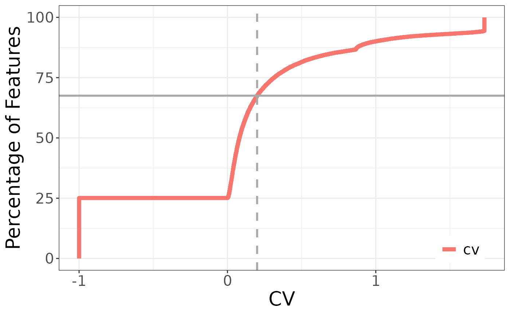
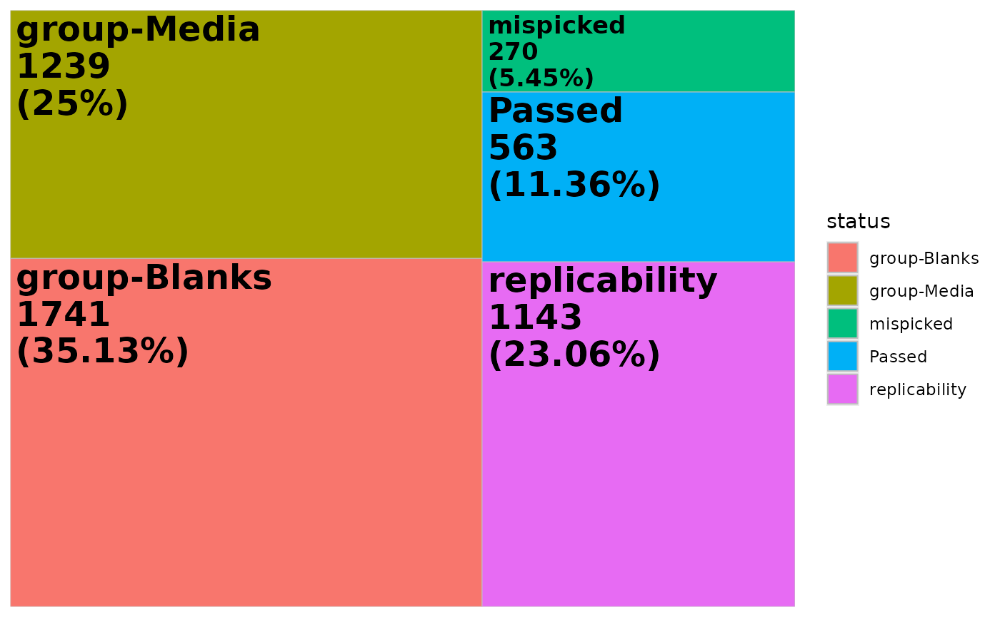
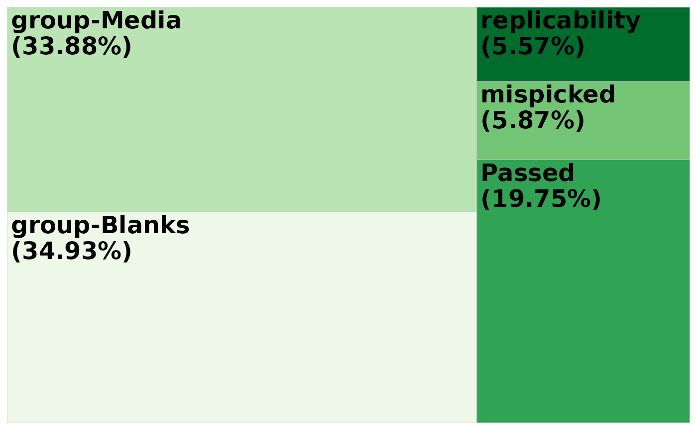
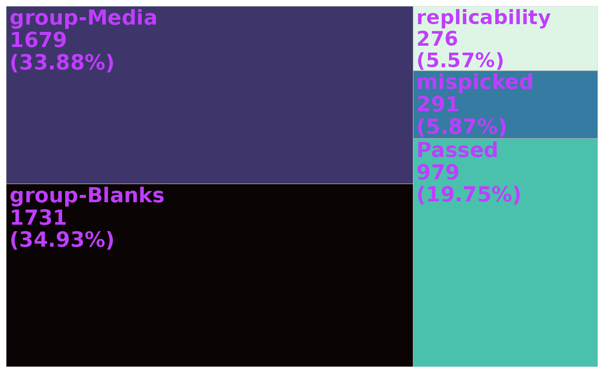

# Filter with mpact original data

``` r

# library(mpactr)
library(mpactr)
library(tidyverse)
library(data.table)
```

## Load data into R

mpactr requires 2 files as input: a feature table and metadata file.
Both are expected to be comma separated files (*.csv*).

1.  peak_table: a peak table in Progenesis format is expected. To export
    a compatible peak table in Progenesis, navigate to the *Review
    Compounds* tab then File -\> Export Compound Measurements. Select
    the following properties: Compound, m/z, Retention time (min), and
    Raw abundance and click ok.
2.  metadata: a table with sample information. At minimum the following
    columns are expected: Injection, Sample_Code, Biological_Group.
    Injection is the sample name and is expected to match sample column
    names in the peak_table. Sample_Code is the id for technical
    replicate groups. Biological_Group is the id for biological
    replicate groups. Other sample metadata can be added, and is
    encouraged for downstream analysis following filtering with mpactr.

To import these data into R, use the mpactr function
[`import_data()`](https://www.mums2.org/mpactr/reference/import_data.md),
which has the arguments: `peak_table_file_path` and
`meta_data_file_path`. This tutorial will show you examples with data
from the original mpact program, found on
[GitHub](https://github.com/BalunasLab/mpact/tree/main/rawdata/PTY087I2).
This dataset contain 38 samples for biological groups solvent blanks,
media blanks, Streptomyces sp. PTY08712 grown with (250um_Ce) and
without (0um_Ce) rare earth element cerium. For more information about
the experiments conducted see [Samples, Puckett, and Balunas
2023](https://pubs.acs.org/doi/abs/10.1021/acs.analchem.2c04632).

The original program has sample metadata split across two files: the
sample list and metadata. mpactr accepts a single file, so we need to
combine these in one prior to import with
[`import_data()`](https://www.mums2.org/mpactr/reference/import_data.md).

Loading the sample list…

``` r

samplelist <- fread(example_path("PTY087I2_samplelist.csv"))
```

Loading the metadata list…

``` r

metadata <- fread(example_path("PTY087I2_extractmetadata.csv"))
```

Our sample list contains additional blank samples that are not in the
feature table, and therefore should be removed prior to import.

``` r

samples <- fread(example_path("PTY087I2_dataset.csv"), skip = 2) %>%
  colnames() %>%
  str_subset(., "200826")

meta_data <- samplelist %>%
  left_join(metadata, by = "Sample_Code") %>%
  filter(Injection %in% samples)
```

Now we can import the data. We will provide the url for the
`peak_table`, and our reformatted meta_data object. This peak table was
exported from Progenesis, so we will set the `format` argument to
Progenesis.

``` r

data <- import_data(peak_table = example_path("PTY087I2_dataset.csv"),
  meta_data = meta_data,
  format = "Progenesis"
)
```

This will create an R6 class object, which will store both the peak
table and metadata.

Calling the new mpactr object will print the current peak table in the
terminal:

``` r

data
#>               Compound       mz        rt 200826_blank1_r1 200826_blank1_r2
#>                 <char>    <num>     <num>            <num>            <num>
#>    1:   0.80_418.1451n 419.1521 0.8027667          0.00000         0.000000
#>    2: 0.81_210.0803m/z 210.0803 0.8099167          0.00000         0.000000
#>    3:   4.11_444.1061n 889.2190 4.1109833          0.00000         0.000000
#>    4:   4.11_400.0799n 401.0872 4.1109833          0.00000         0.000000
#>    5:   0.80_627.2171n 650.2063 0.8027667          0.00000         0.000000
#>   ---                                                                      
#> 4952: 8.95_740.1659m/z 740.1659 8.9477667         50.86249         0.000000
#> 4953: 9.94_801.6828m/z 801.6828 9.9434667         11.08239         1.229457
#> 4954: 8.45_702.2132m/z 702.2132 8.4499000        257.47905        38.155170
#> 4955: 8.35_664.5170m/z 664.5170 8.3506167        284.44529       291.579543
#> 4956: 8.88_467.1028m/z 467.1028 8.8770500       2150.74323         0.000000
#>       200826_blank1_r3 200826_PTY087I2_0umce1_r1 200826_PTY087I2_0umce1_r2
#>                  <num>                     <num>                     <num>
#>    1:       0.00000000              3.020244e+05              3.056620e+05
#>    2:       0.00000000              1.655825e+05              1.668336e+05
#>    3:       0.00000000              3.401869e+04              3.530162e+04
#>    4:       0.00000000              4.358187e+04              4.370543e+04
#>    5:       0.00000000              4.332639e+04              4.388268e+04
#>   ---                                                                     
#> 4952:       0.00000000              4.148686e+01              7.871277e+00
#> 4953:       9.07128542              9.266055e-02              1.530647e-01
#> 4954:       0.00000000              1.732118e+03              0.000000e+00
#> 4955:       0.01844371              3.013042e+01              3.180264e+01
#> 4956:       0.00000000              0.000000e+00              1.028675e+03
#>       200826_PTY087I2_0umce1_r3 200826_PTY087I2_0umce2_r1
#>                           <num>                     <num>
#>    1:              3.101702e+05              2.978810e+05
#>    2:              1.675075e+05              1.625522e+05
#>    3:              3.543251e+04              2.000822e+04
#>    4:              4.357772e+04              3.155634e+04
#>    5:              4.557824e+04              4.335971e+04
#>   ---                                                    
#> 4952:              0.000000e+00              5.231151e-01
#> 4953:              3.667251e-01              0.000000e+00
#> 4954:              0.000000e+00              1.925907e+03
#> 4955:              3.135295e+01              3.848152e+01
#> 4956:              0.000000e+00              0.000000e+00
#>       200826_PTY087I2_0umce2_r2 200826_PTY087I2_0umce2_r3
#>                           <num>                     <num>
#>    1:              3.035890e+05              302993.80270
#>    2:              1.647463e+05              163903.73400
#>    3:              2.005072e+04               20880.29986
#>    4:              3.127270e+04               32045.00687
#>    5:              4.480789e+04               44925.54654
#>   ---                                                    
#> 4952:              0.000000e+00                   0.00000
#> 4953:              4.336638e+00                  16.76814
#> 4954:              0.000000e+00                   0.00000
#> 4955:              3.330928e+01                  39.86223
#> 4956:              1.324812e+03                   0.00000
#>       200826_PTY087I2_0umce3_r1 200826_PTY087I2_0umce3_r2
#>                           <num>                     <num>
#>    1:              302974.58390              303741.67880
#>    2:              163537.75040              163110.51990
#>    3:               22257.61067               23254.43336
#>    4:               32885.51773               34089.23273
#>    5:               44175.78590               44779.28226
#>   ---                                                    
#> 4952:                   0.00000                   0.00000
#> 4953:                  22.20122                  27.34200
#> 4954:                3572.79179                   0.00000
#> 4955:                  40.88535                  31.80185
#> 4956:                   0.00000                2695.52447
#>       200826_PTY087I2_0umce3_r3 200826_PTY087I2_250umce1_r1
#>                           <num>                       <num>
#>    1:              305307.58880                304461.58900
#>    2:              162538.71820                159919.35920
#>    3:               23551.62571                115011.92150
#>    4:               34572.55101                 86989.85992
#>    5:               45432.68848                 46936.50804
#>   ---                                                      
#> 4952:                   0.00000                    10.90783
#> 4953:                  18.40502                    19.33673
#> 4954:                   0.00000                  2909.45195
#> 4955:                  37.87828                    36.48544
#> 4956:                   0.00000                     0.00000
#>       200826_PTY087I2_250umce1_r2 200826_PTY087I2_250umce1_r3
#>                             <num>                       <num>
#>    1:                3.059096e+05                301102.32680
#>    2:                1.622441e+05                160509.21490
#>    3:                1.137904e+05                111088.30390
#>    4:                8.660144e+04                 84092.94428
#>    5:                4.671744e+04                 44639.13434
#>   ---                                                        
#> 4952:                0.000000e+00                     0.00000
#> 4953:                8.184311e+00                    21.90738
#> 4954:                0.000000e+00                     0.00000
#> 4955:                3.628852e+01                    29.76471
#> 4956:                2.857433e+03                     0.00000
#>       200826_PTY087I2_250umce2_r1 200826_PTY087I2_250umce2_r2
#>                             <num>                       <num>
#>    1:                2.950731e+05                294507.85260
#>    2:                1.569863e+05                157018.74160
#>    3:                9.171678e+04                 93573.47803
#>    4:                7.609289e+04                 76935.45726
#>    5:                4.381261e+04                 44053.75013
#>   ---                                                        
#> 4952:                6.760895e+00                     0.00000
#> 4953:                7.221771e+00                    15.49070
#> 4954:                3.327218e+03                     0.00000
#> 4955:                2.518465e+01                    31.12184
#> 4956:                0.000000e+00                  3328.19867
#>       200826_PTY087I2_250umce2_r3 200826_PTY087I2_250umce3_r1
#>                             <num>                       <num>
#>    1:                2.929342e+05                2.965014e+05
#>    2:                1.581785e+05                1.587843e+05
#>    3:                9.163425e+04                1.096399e+05
#>    4:                7.578763e+04                8.364374e+04
#>    5:                4.269494e+04                4.389627e+04
#>   ---                                                        
#> 4952:                0.000000e+00                1.476297e+01
#> 4953:                9.325017e+00                5.648035e-03
#> 4954:                2.368871e-02                1.814666e+03
#> 4955:                3.390672e+01                3.206222e+01
#> 4956:                0.000000e+00                0.000000e+00
#>       200826_PTY087I2_250umce3_r2 200826_PTY087I2_250umce3_r3 200826_media1_r1
#>                             <num>                       <num>            <num>
#>    1:                285505.55760                2.974424e+05     2.554827e+05
#>    2:                156528.89670                1.580228e+05     1.705910e+05
#>    3:                105935.69660                1.093869e+05     0.000000e+00
#>    4:                 82556.23968                8.342072e+04     0.000000e+00
#>    5:                 40825.92921                4.428666e+04     3.381575e+04
#>   ---                                                                         
#> 4952:                     0.00000                0.000000e+00     5.259717e+01
#> 4953:                     0.00000                1.223522e+00     4.605544e+00
#> 4954:                     0.00000                0.000000e+00     1.498701e+03
#> 4955:                    31.94794                4.173415e+01     7.619112e+03
#> 4956:                  2671.52999                0.000000e+00     2.386338e+02
#>       200826_media1_r2 200826_media1_r3 200826_media2_r1 200826_media2_r2
#>                  <num>            <num>            <num>            <num>
#>    1:     2.599233e+05     256021.50590     256086.16490     2.547825e+05
#>    2:     1.726717e+05     170716.05390     168874.36980     1.676367e+05
#>    3:     0.000000e+00          0.00000          0.00000     0.000000e+00
#>    4:     1.431221e-02          0.00000          0.00000     0.000000e+00
#>    5:     3.397754e+04      33169.47338      34372.98871     3.400355e+04
#>   ---                                                                    
#> 4952:     0.000000e+00         83.52441          0.00000     0.000000e+00
#> 4953:     1.084082e+01          2.18883          8.67406     3.569775e+00
#> 4954:     0.000000e+00          0.00000         18.25012     0.000000e+00
#> 4955:     8.962027e+00         48.01832         13.24781     1.311910e+01
#> 4956:     2.095771e+02          0.00000          0.00000     2.203997e+02
#>       200826_media2_r3 200826_media3_r1 200826_media3_r2 200826_media3_r3
#>                  <num>            <num>            <num>            <num>
#>    1:     2.565244e+05     2.601417e+05     2.526247e+05     2.582542e+05
#>    2:     1.692963e+05     1.695131e+05     1.672526e+05     1.707665e+05
#>    3:     0.000000e+00     0.000000e+00     0.000000e+00     0.000000e+00
#>    4:     0.000000e+00     0.000000e+00     0.000000e+00     0.000000e+00
#>    5:     3.396147e+04     3.518284e+04     3.317613e+04     3.422295e+04
#>   ---                                                                    
#> 4952:     0.000000e+00     0.000000e+00     0.000000e+00     0.000000e+00
#> 4953:     3.475497e+00     2.908507e+00     7.279138e+00     1.909397e+00
#> 4954:     0.000000e+00     1.539513e+03     3.443881e+01     6.352884e+01
#> 4955:     1.589438e+01     2.351233e+01     1.777778e+01     2.357445e+01
#> 4956:     0.000000e+00     0.000000e+00     7.790370e+02     0.000000e+00
#>             kmd
#>           <num>
#>    1: 0.1520828
#>    2: 0.0803421
#>    3: 0.2189760
#>    4: 0.0872034
#>    5: 0.2063013
#>   ---          
#> 4952: 0.1658522
#> 4953: 0.6828202
#> 4954: 0.2131724
#> 4955: 0.5170432
#> 4956: 0.1028370
```

## Accessing data in mpactr object

You can extract the peak table or metadata at any point with
[`get_raw_data()`](https://www.mums2.org/mpactr/reference/get_raw_data.md),
[`get_peak_table()`](https://www.mums2.org/mpactr/reference/get_peak_table.md)
and
[`get_meta_data()`](https://www.mums2.org/mpactr/reference/get_meta_data.md)
functions. Both functions will return a `data.table` object with the
corresponding information.

### Extract peak table

The raw peak table is the unfiltered peak table used as input to mpactr.
To extract the raw input peak table, use the function
[`get_raw_data()`](https://www.mums2.org/mpactr/reference/get_raw_data.md).

``` r

get_raw_data(data)[1:5, 1:8]
#>            Compound       mz        rt 200826_blank1_r1 200826_blank1_r2
#>              <char>    <num>     <num>            <num>            <num>
#> 1:   0.80_418.1451n 419.1521 0.8027667                0                0
#> 2: 0.81_210.0803m/z 210.0803 0.8099167                0                0
#> 3:   4.11_444.1061n 889.2190 4.1109833                0                0
#> 4:   4.11_400.0799n 401.0872 4.1109833                0                0
#> 5:   0.80_627.2171n 650.2063 0.8027667                0                0
#>    200826_blank1_r3 200826_PTY087I2_0umce1_r1 200826_PTY087I2_0umce1_r2
#>               <num>                     <num>                     <num>
#> 1:                0                 302024.40                 305662.05
#> 2:                0                 165582.52                 166833.63
#> 3:                0                  34018.69                  35301.62
#> 4:                0                  43581.87                  43705.43
#> 5:                0                  43326.39                  43882.68
```

The raw peak table will not change as filters are applied to the data.
If you want to extract the filtered peak table, with filters that have
been applied, use
[`get_peak_table()`](https://www.mums2.org/mpactr/reference/get_peak_table.md):

``` r

get_peak_table(data)[1:5, 1:8]
#>            Compound       mz        rt 200826_blank1_r1 200826_blank1_r2
#>              <char>    <num>     <num>            <num>            <num>
#> 1:   0.80_418.1451n 419.1521 0.8027667                0                0
#> 2: 0.81_210.0803m/z 210.0803 0.8099167                0                0
#> 3:   4.11_444.1061n 889.2190 4.1109833                0                0
#> 4:   4.11_400.0799n 401.0872 4.1109833                0                0
#> 5:   0.80_627.2171n 650.2063 0.8027667                0                0
#>    200826_blank1_r3 200826_PTY087I2_0umce1_r1 200826_PTY087I2_0umce1_r2
#>               <num>                     <num>                     <num>
#> 1:                0                 302024.40                 305662.05
#> 2:                0                 165582.52                 166833.63
#> 3:                0                  34018.69                  35301.62
#> 4:                0                  43581.87                  43705.43
#> 5:                0                  43326.39                  43882.68
```

### Extract metadata

Metadata can be accessed with
[`get_meta_data()`](https://www.mums2.org/mpactr/reference/get_meta_data.md):

``` r

get_meta_data(data)[1:5, ]
#>           Injection File Text Sample_Notes                     MS method
#>              <char>    <lgcl>       <lgcl>                        <char>
#> 1: 200826_blank1_r1        NA           NA RMS20181105_Balunas_11min_mse
#> 2: 200826_blank1_r2        NA           NA RMS20181105_Balunas_11min_mse
#> 3: 200826_blank1_r3        NA           NA RMS20181105_Balunas_11min_mse
#> 4: 200826_media1_r1        NA           NA RMS20181105_Balunas_11min_mse
#> 5: 200826_media1_r2        NA           NA RMS20181105_Balunas_11min_mse
#>                                                         LC method Vial_Position
#>                                                            <char>        <char>
#> 1: jlb20170623_Balunas_11minRogermethod_450uLmin_5to98_col3_noPDA          1:16
#> 2: jlb20170623_Balunas_11minRogermethod_450uLmin_5to98_col3_noPDA          1:16
#> 3: jlb20170623_Balunas_11minRogermethod_450uLmin_5to98_col3_noPDA          1:16
#> 4: jlb20170623_Balunas_11minRogermethod_450uLmin_5to98_col3_noPDA          1:01
#> 5: jlb20170623_Balunas_11minRogermethod_450uLmin_5to98_col3_noPDA          1:01
#>    Injection volume Sample_Code  Organism Biological_Group Extract_Notes
#>               <int>      <char>    <char>           <char>        <char>
#> 1:               10       Blank  50% MeOH           Blanks      50% MeOH
#> 2:               10       Blank  50% MeOH           Blanks      50% MeOH
#> 3:               10       Blank  50% MeOH           Blanks      50% MeOH
#> 4:               10      MB1109 GYM_Media            Media     GYM_Media
#> 5:               10      MB1109 GYM_Media            Media     GYM_Media
```

## Reference semantics

mpactr is built on an R6 class-system, meaning it operates on reference
semantics in which data is updated *in-place*. Compared to a shallow
copy, where only data pointers are copied, or a deep copy, where the
entire data object is copied in memory, any changes to the original data
object, regardless if they are assigned to a new object, result in
changes to the original data object. We can see this below.

Where the raw data object has 4956 ions in the feature table:

``` r

data2 <- import_data(peak_table = example_path("PTY087I2_dataset.csv"),
  meta_data = meta_data,
  format = "Progenesis"
)

get_peak_table(data2)[, 1:5]
#>               Compound       mz        rt 200826_blank1_r1 200826_blank1_r2
#>                 <char>    <num>     <num>            <num>            <num>
#>    1:   0.80_418.1451n 419.1521 0.8027667          0.00000         0.000000
#>    2: 0.81_210.0803m/z 210.0803 0.8099167          0.00000         0.000000
#>    3:   4.11_444.1061n 889.2190 4.1109833          0.00000         0.000000
#>    4:   4.11_400.0799n 401.0872 4.1109833          0.00000         0.000000
#>    5:   0.80_627.2171n 650.2063 0.8027667          0.00000         0.000000
#>   ---                                                                      
#> 4952: 8.95_740.1659m/z 740.1659 8.9477667         50.86249         0.000000
#> 4953: 9.94_801.6828m/z 801.6828 9.9434667         11.08239         1.229457
#> 4954: 8.45_702.2132m/z 702.2132 8.4499000        257.47905        38.155170
#> 4955: 8.35_664.5170m/z 664.5170 8.3506167        284.44529       291.579543
#> 4956: 8.88_467.1028m/z 467.1028 8.8770500       2150.74323         0.000000
```

We can run the `filter_mispicked_ions` filter, with default setting
`copy_object = FALSE` (operates on reference semantics).

``` r

data2_mispicked <- filter_mispicked_ions(data2,
  ringwin = 0.5,
  isowin = 0.01, trwin = 0.005,
  max_iso_shift = 3, merge_peaks = TRUE,
  merge_method = "sum",
  copy_object = FALSE
)
#> ℹ Checking 4956 peaks for mispicked peaks.
#> ℹ Argument merge_peaks is: TRUE. Merging mispicked peaks with method sum.
#> ✔ 291 ions failed the mispicked filter, 4665 ions remain.

get_peak_table(data2_mispicked)[, 1:5]
#> Key: <Compound, mz, kmd, rt>
#>               Compound        mz        kmd         rt
#>                 <char>     <num>      <num>      <num>
#>    1: 0.03_102.1549m/z 102.15495 0.15494700 0.03431667
#>    2: 0.04_113.9641m/z 113.96412 0.96411580 0.04146667
#>    3: 0.06_182.9860m/z 182.98601 0.98600990 0.05573333
#>    4: 0.06_235.9635m/z 235.96353 0.96353360 0.05573333
#>    5:  0.09_68.9936m/z  68.99356 0.99355728 0.09145000
#>   ---                                                 
#> 4661: 9.99_463.1718m/z 463.17181 0.17180700 9.98643333
#> 4662: 9.99_480.7214m/z 480.72136 0.72135840 9.98643333
#> 4663:  9.99_87.5099m/z  87.50993 0.50992700 9.99358333
#> 4664:  9.99_92.9671m/z  92.96709 0.96708947 9.98643333
#> 4665:  9.99_95.0612m/z  95.06120 0.06119876 9.99358333
#>       200826_PTY087I2_0umce1_r1
#>                           <num>
#>    1:                   0.00000
#>    2:                 177.21710
#>    3:                5632.81768
#>    4:                  17.36759
#>    5:                  13.93727
#>   ---                          
#> 4661:                  85.71503
#> 4662:                   0.00000
#> 4663:                  26.94538
#> 4664:                  46.99969
#> 4665:                  31.83990
```

This results in 4665 ions in the feature table (above). Even though we
created an object called `data2_mispicked`, the original `data2` object
was also updated and now has 4665 ions in the feature table:

``` r

get_peak_table(data2)[, 1:5]
#> Key: <Compound, mz, kmd, rt>
#>               Compound        mz        kmd         rt
#>                 <char>     <num>      <num>      <num>
#>    1: 0.03_102.1549m/z 102.15495 0.15494700 0.03431667
#>    2: 0.04_113.9641m/z 113.96412 0.96411580 0.04146667
#>    3: 0.06_182.9860m/z 182.98601 0.98600990 0.05573333
#>    4: 0.06_235.9635m/z 235.96353 0.96353360 0.05573333
#>    5:  0.09_68.9936m/z  68.99356 0.99355728 0.09145000
#>   ---                                                 
#> 4661: 9.99_463.1718m/z 463.17181 0.17180700 9.98643333
#> 4662: 9.99_480.7214m/z 480.72136 0.72135840 9.98643333
#> 4663:  9.99_87.5099m/z  87.50993 0.50992700 9.99358333
#> 4664:  9.99_92.9671m/z  92.96709 0.96708947 9.98643333
#> 4665:  9.99_95.0612m/z  95.06120 0.06119876 9.99358333
#>       200826_PTY087I2_0umce1_r1
#>                           <num>
#>    1:                   0.00000
#>    2:                 177.21710
#>    3:                5632.81768
#>    4:                  17.36759
#>    5:                  13.93727
#>   ---                          
#> 4661:                  85.71503
#> 4662:                   0.00000
#> 4663:                  26.94538
#> 4664:                  46.99969
#> 4665:                  31.83990
```

We recommend using the default `copy_object = FALSE` as this makes for
an extremely fast and memory-efficient way to chain mpactr filters
together (see **Chaining filters together** section and [Reference
Semantics](https://www.mums2.org/mpactr/articles/reference_semantics.md));
however, if you would like to run the filters individually with
traditional R style objects, you can set `copy_object` to `TRUE` as
shown in the filter examples.

## Filtering

mpactr provides filters to correct for the following issues observed
during preprocessing of tandem MS/MS data:

- mispicked ions: isotopic patterns that are incorrectly split during
  preprocessing.
- solvent blank contamination: removal of features present in solvent
  blanks due to carryover between samples.
- background components: features whose abundance is greater than
  user-defined abundance threshold in a specific group of samples, for
  example media blanks.
- non-reproducible ions: those that are inconsistent between technical
  replicates.
- insource ions: fragment ions created during ionization before
  fragmentation in the tandem MS/MS workflow.

#### Mispicked ions filter

To check for mispicked ions, use mpactr function
[`filter_mispicked_ions()`](https://www.mums2.org/mpactr/reference/filter_mispicked_ions.md).
This function takes an `mpactr object` as input, and checks for similar
ions with the arguments `ringwin`, `isowin`, `trwin` and
`max_iso_shift`.

Ions in the feature table are flagged as similar based on retention time
and mass. Flagged ion groups are suggested to be the result of incorrect
splitting of isotopic patterns during peak picking, detector saturation
artifacts, or incorrect identification of multiply charged oligomers.

``` r

data_mispicked <- filter_mispicked_ions(data,
  ringwin = 0.5,
  isowin = 0.01, trwin = 0.005,
  max_iso_shift = 3, merge_peaks = TRUE,
  merge_method = "sum",
  copy_object = TRUE
)
#> ℹ Checking 4956 peaks for mispicked peaks.
#> ℹ Argument merge_peaks is: TRUE. Merging mispicked peaks with method sum.
#> ✔ 291 ions failed the mispicked filter, 4665 ions remain.
```

Each filter reports progress of filtering, here we can see that 4956
ions were present prior to checking for mispicked ions. 291 ions were
found to be similar to another ion and following merging, 4665 ions
remain.

If you are interested in the groups of similar ions flagged in this
filter, you can use
[`get_similar_ions()`](https://www.mums2.org/mpactr/reference/get_similar_ions.md).
This function returns a `data.table` reporting the main ion (the ion
retained post-merging) and the ions similar to it.

``` r

head(get_similar_ions(data_mispicked))
#>            main_ion                      similar_ions
#>              <char>                            <list>
#> 1:  9.97_83.5172m/z                   9.97_84.9592m/z
#> 2:  9.97_91.0082m/z   9.97_91.5049m/z,9.97_93.5039m/z
#> 3:  1.99_91.0545m/z                   1.99_93.0679m/z
#> 4: 2.00_103.0545m/z                  2.00_105.0674m/z
#> 5: 9.99_106.0043m/z                  9.99_108.0234m/z
#> 6: 9.97_111.0207m/z 9.97_111.5219m/z,9.97_112.5194m/z
```

#### Remove ions that are above a threshold in one biological group

Removing solvent blank impurities is important for correcting for
between-sample carryover and contamination in experimental samples. You
can identify and remove these ions with mpactr’s
[`filter_group()`](https://www.mums2.org/mpactr/reference/filter_group.md)
function.
[`filter_group()`](https://www.mums2.org/mpactr/reference/filter_group.md)
identifies ions above a relative abundance threshold (`group_threshold`)
in a specific group (`group_to_remove`). To remove solvent blank
impurities, set `group_to_remove` to the `Biological_Group` in your
metadata file which corresponds to your solvent blank samples, here
“Blanks”.

``` r

data_blank <- filter_group(data,
  group_threshold = 0.01,
  group_to_remove = "Blanks", remove_ions = TRUE,
  copy_object = TRUE
)
#> ℹ Parsing 4956 peaks based on the sample group: Blanks.
#> ℹ Argument remove_ions is: TRUE.Removing peaks from Blanks.
#> ✔ 1822 ions failed the Blanks filter, 3134 ions remain.
```

In this example, 4956 ions were present prior to the group filter. 1822
ions were found to be above the relative abundance threshold of 0.01 in
“Solvent_Blank” samples, leaving 3134 ions in the peak table.

We can also use this filter to remove ions from other groups, such as
media blanks. This can be useful for experiments on cell cultures. The
example data contains samples belonging to the `Biological_Group`
“Media”. These samples are from media blanks, which are negative
controls from the growth experiments conducted in this study. We can
remove features whose abundance is greater than 1% of the largest group
in media blank samples by specifying `group_to_remove` = “Media”. We
recommend removing media blank ions following all other filters so all
high-quality ions are identified (see Chaining filters together below).

``` r

data_media_blank <- filter_group(data,
  group_threshold = 0.01,
  group_to_remove = "Media", remove_ions = TRUE,
  copy_object = TRUE
)
#> ℹ Parsing 4956 peaks based on the sample group: Media.
#> ℹ Argument remove_ions is: TRUE.Removing peaks from Media.
#> ✔ 3936 ions failed the Media filter, 1020 ions remain.
```

#### Remove non-reproducible ions

Ions whose abundance are not consistent between technical replicates
(*i.e.*, non-reproducible) may not be reliable for analysis and
therefore should be removed from the feature table. Non-reproducible
ions are identified by coefficient of variation (CV) between technical
replicates with
[`filter_cv()`](https://www.mums2.org/mpactr/reference/filter_cv.md).
Note - this filter cannot be applied to data that does not contain
technical replicates.

``` r

data_rep <- filter_cv(data,
  cv_threshold = 0.2,
  copy_object = TRUE
)
#> ℹ Parsing 4956 peaks for replicability across technical replicates.
#> ✔ 797 ions failed the cv_filter filter, 4159 ions remain.
```

In our example dataset, 797 ions were flagged as non-reproducible. These
ions were removed, leaving 4159 ions in the feature table.

If you would like to visualize how the CV threshold performed on your
dataset, you can extract the CV calculated during `filer_cv()` using
mpactr’s
[`get_cv_data()`](https://www.mums2.org/mpactr/reference/get_cv_data.md)
function, and calculate the percentage of features for plotting. You can
look at both mean and median CV as shown in the example below, or you
can filter the data by the parameter of choice.

``` r

cv <- get_cv_data(data_rep) %>%
  pivot_longer(cols = c("cv"),
               names_to = "param",
               values_to = "cv") %>%
  nest(.by = param) %>%
  mutate(
    data = map(data, arrange, cv),
    data = map(data, mutate, index = 0:(length(cv) - 1)),
    data = map(data, mutate, index_scale = index * 100 / length(cv))
  )

head(cv)
#> # A tibble: 1 × 2
#>   param data                 
#>   <chr> <list>               
#> 1 cv    <tibble [49,560 × 7]>
```

The nested data are tibbles with the columns Compound, Biological_Group,
Sample_Code, PassesCvFilter, cv, index, index_scale:

    #> # A tibble: 6 × 7
    #>   Compound   Biological_Group Sample_Code PassesCvFilter    cv index index_scale
    #>   <chr>      <chr>            <chr>       <lgl>          <dbl> <int>       <dbl>
    #> 1 0.03_102.… Media            MB1109      FALSE             -1     0     0      
    #> 2 0.03_102.… Media            MB1110      FALSE             -1     1     0.00202
    #> 3 0.03_102.… Media            MB1111      FALSE             -1     2     0.00404
    #> 4 0.03_102.… 0um_Ce           MB1112      FALSE             -1     3     0.00605
    #> 5 0.03_102.… 0um_Ce           MB1113      FALSE             -1     4     0.00807
    #> 6 0.03_102.… 0um_Ce           MB1114      FALSE             -1     5     0.0101

There is one tibble for each parameter. We also want to calculate the
percentage of features represented by the CV threshold.

``` r

cv_thresh_percent <- cv %>%
  filter(param == "cv") %>%
  unnest(cols = data) %>%
  mutate(diff_cv_thresh = abs(cv - 0.2)) %>%
  slice_min(diff_cv_thresh, n = 1) %>%
  pull(index_scale)

cv_thresh_percent
#> [1] 67.53027
```

Then we can plot percentage of features by CV:

``` r

cv %>%
  unnest(cols = data) %>%
  mutate(param = factor(param, levels = c("cv"),
                        labels = c("cv"))) %>%
  ggplot() +
  aes(x = cv, y = index_scale, group = param, color = param) +
  geom_line(linewidth = 2) +
  geom_vline(xintercept = 0.2,
             color = "darkgrey",
             linetype = "dashed",
             linewidth = 1) +
  geom_hline(yintercept = cv_thresh_percent,
             color = "darkgrey",
             linewidth = 1) +
  labs(x = "CV",
       y = "Percentage of Features",
       param = "Statistic") +
  theme_bw() +
  theme(
    axis.title = element_text(size = 20),
    axis.text = element_text(size = 15),
    legend.position = "inside",
    legend.position.inside = c(.90, .08),
    legend.title = element_blank(),
    legend.text = element_text(size = 15)
  )
#> Ignoring unknown labels:
#> • param : "Statistic"
```



Here we can see that roughly 68% of features were below the CV threshold
meaning 32% were removed at a CV threshold of 0.2.

#### Remove insource fragment ions

Some mass species can be fragmented during ionization in tandem MS/MS,
creating insource ions. This can result in ions from one compound being
represented more than once in the feature table. If you would like to
remove insource ions fragments, you can do so with mpactr’s
[`filter_insource_ions()`](https://www.mums2.org/mpactr/reference/filter_insource_ions.md).
[`filter_insource_ions()`](https://www.mums2.org/mpactr/reference/filter_insource_ions.md)
conducts ion deconvolution via retention time correlation matrices
within MS1 scans. Highly correlated ion groups are determined by the
`cluster_threshold` parameter and filtered to remove the low mass
features. The highest mass feature is identified as the likely precursor
ion and retained in the feature table.

``` r

data_insource <- filter_insource_ions(data,
  cluster_threshold = 0.95,
  copy_object = TRUE
)
#> ℹ Parsing 4956 peaks for insource ions.
#> ✔ 600 ions failed the insource filter, 4356 ions remain.
```

600 ions were identified and removed during deconvolution of this
dataset, leaving 4356 ions in the feature table.

#### Chaining filters together

Filters can be chained in a customizable workflow, shown below. While
filters can be chained in any order, we recommend filtering mispicked
ions, then solvent blanks, prior to filtering non-reproducible or
insource ions. This will allow for incorrectly picked peaks to be merged
and any contamination/carryover removed prior to identifying
non-reproducible and insource fragment ions. Here we also demonstrate
the removal of media blank components with the
[`filter_group()`](https://www.mums2.org/mpactr/reference/filter_group.md)
function after identification of high-quality ions.

``` r

data <- import_data(peak_table = example_path("PTY087I2_dataset.csv"),
  meta_data = meta_data,
  format = "Progenesis"
)

data_filtered <- filter_mispicked_ions(data, merge_method = "sum") |>
  filter_group(group_to_remove = "Blanks") |>
  filter_cv(cv_threshold = 0.2) |>
  filter_group(group_to_remove = "Media")
#> ℹ Checking 4956 peaks for mispicked peaks.
#> ℹ Argument merge_peaks is: TRUE. Merging mispicked peaks with method sum.
#> ✔ 291 ions failed the mispicked filter, 4665 ions remain.
#> ℹ Parsing 4665 peaks based on the sample group: Blanks.
#> ℹ Argument remove_ions is: TRUE.Removing peaks from Blanks.
#> ✔ 1731 ions failed the Blanks filter, 2934 ions remain.
#> ℹ Parsing 2934 peaks for replicability across technical replicates.
#> ✔ 276 ions failed the cv_filter filter, 2658 ions remain.
#> ℹ Parsing 2658 peaks based on the sample group: Media.
#> ℹ Argument remove_ions is: TRUE.Removing peaks from Media.
#> ✔ 1679 ions failed the Media filter, 979 ions remain.
```

## Summary

mpactr offers multiple ways to view a summary of data filtering.

#### View passing and failed ions for a single filter

If you are interested in viewing the passing and failing ions for a
single filter, use the
[`filter_summary()`](https://www.mums2.org/mpactr/reference/filter_summary.md)
function. You must specify which filter you are interested in, either
“mispicked”, “group”, “replicability”, or “insource”.

``` r

mispicked_summary <- filter_summary(data_filtered, filter = "mispicked")
```

Failed ions:

``` r

head(mispicked_summary$failed_ions, 100)
#>   [1] "9.97_84.9592m/z"   "9.97_91.5049m/z"   "9.97_93.5039m/z"  
#>   [4] "1.99_93.0679m/z"   "2.00_105.0674m/z"  "9.99_108.0234m/z" 
#>   [7] "9.97_111.5219m/z"  "9.97_112.5194m/z"  "9.97_113.0173m/z" 
#>  [10] "2.32_117.0586m/z"  "2.32_118.0660m/z"  "2.00_120.0817m/z" 
#>  [13] "2.00_120.1345m/z"  "2.00_120.1704m/z"  "0.77_118.1157m/z" 
#>  [16] "1.99_120.3792m/z"  "2.32_132.0815m/z"  "0.67_131.5785m/z" 
#>  [19] "1.46_132.1331m/z"  "1.21_133.0896n"    "0.84_139.0507m/z" 
#>  [22] "2.32_143.0736m/z"  "2.32_144.0816m/z"  "0.62_143.5978m/z" 
#>  [25] "0.67_147.1134m/z"  "3.92_151.0634m/z"  "4.62_165.0704m/z" 
#>  [28] "2.00_166.4370m/z"  "1.99_166.1491m/z"  "4.12_176.0628m/z" 
#>  [31] "4.12_178.0782m/z"  "0.62_180.6223m/z"  "10.11_183.0220m/z"
#>  [34] "0.94_186.5569m/z"  "1.21_189.1242m/z"  "0.94_190.0465m/z" 
#>  [37] "3.61_193.0423m/z"  "0.62_195.6240m/z"  "1.19_196.0381n"   
#>  [40] "4.78_198.0854m/z"  "1.21_201.0726m/z"  "1.21_202.1205m/z" 
#>  [43] "2.07_202.1180m/z"  "1.21_201.5936n"    "3.63_207.0634m/z" 
#>  [46] "0.81_210.1507m/z"  "0.81_210.1997m/z"  "0.81_210.2631m/z" 
#>  [49] "0.81_210.4740m/z"  "2.94_212.1208m/z"  "0.65_213.0191m/z" 
#>  [52] "2.07_217.1056m/z"  "1.91_217.1553m/z"  "1.20_218.1109m/z" 
#>  [55] "1.22_221.5316m/z"  "1.21_223.0594m/z"  "1.96_227.6359m/z" 
#>  [58] "1.21_227.1005m/z"  "0.84_226.1553m/z"  "3.72_227.1760m/z" 
#>  [61] "3.63_229.0865m/z"  "1.96_229.6538m/z"  "1.21_231.1367m/z" 
#>  [64] "1.92_234.1403m/z"  "1.22_237.1363m/z"  "0.63_238.1461m/z" 
#>  [67] "2.35_237.1243m/z"  "1.21_244.1664m/z"  "0.66_244.1380m/z" 
#>  [70] "1.21_245.6400m/z"  "1.21_247.1298m/z"  "0.67_123.5768n"   
#>  [73] "2.22_247.1295m/z"  "4.12_250.5607m/z"  "0.62_250.1370m/z" 
#>  [76] "0.62_252.1540m/z"  "2.23_250.1917m/z"  "0.62_252.6512m/z" 
#>  [79] "4.12_253.0563m/z"  "1.82_252.1519m/z"  "0.83_253.1626n"   
#>  [82] "0.75_258.1110m/z"  "3.14_258.5443m/z"  "0.66_257.6233m/z" 
#>  [85] "0.66_258.1473m/z"  "0.75_261.0120m/z"  "1.24_260.1969m/z" 
#>  [88] "3.96_263.5542m/z"  "1.17_265.0928m/z"  "0.64_271.9292m/z" 
#>  [91] "9.97_250.9284n"    "1.21_273.1650m/z"  "1.21_274.0933m/z" 
#>  [94] "2.35_275.6568m/z"  "1.17_275.6450m/z"  "3.43_278.0424m/z" 
#>  [97] "0.64_280.6631m/z"  "1.89_283.6481m/z"  "3.99_286.0659m/z" 
#> [100] "0.64_288.1607m/z"
```

Passing ions:

``` r

head(mispicked_summary$passed_ions, 100)
#>   [1] "0.03_102.1549m/z" "0.04_113.9641m/z" "0.06_182.9860m/z"
#>   [4] "0.06_235.9635m/z" "0.09_68.9936m/z"  "0.10_102.1549m/z"
#>   [7] "0.13_102.1552m/z" "0.17_213.0188m/z" "0.23_102.1549m/z"
#>  [10] "0.28_691.4629m/z" "0.33_102.1550m/z" "0.35_68.9936m/z" 
#>  [13] "0.39_102.1549m/z" "0.40_213.0184m/z" "0.41_145.0360m/z"
#>  [16] "0.43_102.1549m/z" "0.45_345.2033m/z" "0.48_102.1548m/z"
#>  [19] "0.53_102.1550m/z" "0.57_153.7767m/z" "0.57_201.7990m/z"
#>  [22] "0.58_177.4624m/z" "0.59_144.4417m/z" "0.59_203.2244m/z"
#>  [25] "0.59_250.8096m/z" "0.60_129.1388m/z" "0.60_146.1659m/z"
#>  [28] "0.60_182.7792m/z" "0.60_220.1359m/z" "0.60_308.2184m/z"
#>  [31] "0.60_397.4459m/z" "0.61_138.1082m/z" "0.61_173.6264m/z"
#>  [34] "0.61_188.6307m/z" "0.61_195.1269m/z" "0.61_209.1333m/z"
#>  [37] "0.61_210.1284m/z" "0.61_300.1594m/z" "0.62_129.5943m/z"
#>  [40] "0.62_141.5828n"   "0.62_143.0402m/z" "0.62_152.1111m/z"
#>  [43] "0.62_178.1125m/z" "0.62_186.1072m/z" "0.62_187.6351m/z"
#>  [46] "0.62_193.1150m/z" "0.62_202.6318m/z" "0.62_206.6184m/z"
#>  [49] "0.62_207.1142m/z" "0.62_216.1416m/z" "0.62_216.6342m/z"
#>  [52] "0.62_223.1375m/z" "0.62_224.1328m/z" "0.62_230.1451m/z"
#>  [55] "0.62_237.6514m/z" "0.62_242.6282m/z" "0.62_247.8076m/z"
#>  [58] "0.62_249.6332m/z" "0.62_259.1503m/z" "0.62_267.1498m/z"
#>  [61] "0.62_273.6578m/z" "0.62_281.1568m/z" "0.62_295.1650m/z"
#>  [64] "0.62_312.1757m/z" "0.63_102.1551m/z" "0.63_119.4797m/z"
#>  [67] "0.63_133.4769m/z" "0.63_153.9915m/z" "0.63_156.5933m/z"
#>  [70] "0.63_166.1144m/z" "0.63_174.5051m/z" "0.63_192.1185m/z"
#>  [73] "0.63_200.6172m/z" "0.63_214.9373m/z" "0.63_221.1212m/z"
#>  [76] "0.63_228.6148m/z" "0.63_235.6279m/z" "0.63_245.1423m/z"
#>  [79] "0.63_265.4417m/z" "0.63_268.1517m/z" "0.63_269.1494m/z"
#>  [82] "0.63_270.1403n"   "0.63_280.1518m/z" "0.63_283.9593m/z"
#>  [85] "0.63_311.9542m/z" "0.64_102.0344m/z" "0.64_110.9997n"  
#>  [88] "0.64_151.0360m/z" "0.64_161.5051m/z" "0.64_177.7884m/z"
#>  [91] "0.64_185.4569m/z" "0.64_190.4682m/z" "0.64_198.4570m/z"
#>  [94] "0.64_200.1062m/z" "0.64_201.6398m/z" "0.64_209.6270m/z"
#>  [97] "0.64_257.9271m/z" "0.64_259.6555m/z" "0.64_270.9272m/z"
#> [100] "0.64_278.4414m/z"
```

If you set `filter` to a filter name that you did not apply to your
data, an error message will be returned.

``` r

filter_summary(data_filtered, filter = "insource")
#> Error in `mpactr_object$get_log()`:
#> ! `filter` insource has not yet been applied to the data. Run the
#>   corresponding filter function prior to extracting the summary.
```

If you want to retrieve the filter summary for the group filter, you
must also supply the group name with the `group` argument:

``` r

filter_summary(data_filtered, filter = "group", group = "Blanks")
```

`group` must always be supplied for this filter, even if only one group
filter has been applied.

#### View passing and failed ions for all input ions

You can view the filtering status of all input ions with the
[`qc_summary()`](https://www.mums2.org/mpactr/reference/qc_summary.md)
function. A data.table reporting the compound id (`compounds`) and if it
failed or passed filtering. If the ion failed filtering, its status will
report the name of the filter it failed.

``` r

head(qc_summary(data_filtered)[order(compounds), ])
#>          status        compounds
#>          <char>           <char>
#> 1: group-Blanks 0.03_102.1549m/z
#> 2: group-Blanks 0.04_113.9641m/z
#> 3: group-Blanks 0.06_182.9860m/z
#> 4: group-Blanks 0.06_235.9635m/z
#> 5:  group-Media  0.09_68.9936m/z
#> 6: group-Blanks 0.10_102.1549m/z
```

#### Visualize filtering QC with tree map plot

You can visualize filtering results with a tree map using the filtering
summary obtained from
[`qc_summary()`](https://www.mums2.org/mpactr/reference/qc_summary.md)
and the packages `ggplot2` and `treemapify`.

First, we need to determine the number of ions for each ion status in
the summary table. You can report the count; however, we need to
calculate the percent of ions in each group. We have done this in the
code chunk below, where we have used `data.table` syntax as the
[`qc_summary()`](https://www.mums2.org/mpactr/reference/qc_summary.md)
returns a `data.table` object. If you are not familiar with the package
data.table, check out their resources on
[gitlab](https://rdatatable.gitlab.io/data.table/).

``` r

library(ggplot2)
library(treemapify)

ion_counts <- qc_summary(data_filtered)[, .(count = .N), by = status][
  , percent := (count / sum(count) * 100)
]
```

Finally, we plot the treemap:

``` r

tm <- ggplot(ion_counts) +
  aes(area = percent, fill = status) +
  geom_treemap() +
  geom_treemap_text(aes(
    label = paste(status, count, paste0("(", round(percent, 2), "%)"),
                  sep = "\n"),
    fontface = c("bold")
  ))

tm
```



This plot can be customized with ggplot2, for example we only want to
display the percentage:

``` r

tm <- ggplot(ion_counts) +
  aes(area = percent, fill = status) +
  geom_treemap() +
  geom_treemap_text(aes(
    label = paste(status, paste0("(", round(percent, 2), "%)"), sep = "\n"),
    fontface = c("bold")
  ))

tm
```



Or you no longer need the legend and maybe we want custom colors:

``` r

tm +
  scale_fill_brewer(palette = "Greens") +
  theme(legend.position = "none")
```


If you want a fast visualization of the treemap, you can pass the mpactr
object to the function
[`plot_qc_tree()`](https://www.mums2.org/mpactr/reference/plot_qc_tree.md).

``` r

plot_qc_tree(data_filtered)
```


